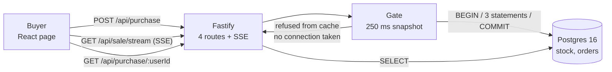

# Flash sale

One product, 1,000 units, a start time and an end time. Thousands of buyers arrive at once, and each
one may take one unit. No unit is ever sold twice.

TypeScript on Node 24. Fastify for the API, Postgres 16 for the decision and the record, React 19
for the page.

## Run it

You need Node 24 or newer and Docker.

```sh
cp .env.example .env     # the port, the stock and the sale window
npm install
npm run db:up            # Postgres in Docker
npm run build            # type checks 3 workspaces, and builds the page
npm start                # the server on :3000
```

Open `http://127.0.0.1:3000`. The page is served by the same server as the API, so there is one URL
and no CORS.

`.env.example` opens the sale in 2026 and closes it in 2036, so the sale is open the moment you
start. Change `SALE_START` and `SALE_END` to see the other states. Where Postgres already runs on
your box, change `POSTGRES_PORT` and the `DATABASE_URL` beside it.

**Tests.** `npm test` runs all 41. Postgres is real, started by testcontainers, so Docker must be
running. Nothing is mocked.

**While you develop.** `npm run dev` runs the server and Vite together. Vite serves the page on
`http://127.0.0.1:5173` and sends `/api` to the server.

**Stop.** `npm run db:down` removes the container and its data.

## Run the stress test

```sh
npm start                # in one terminal
npm run stress           # in another
```

It empties the sale and the orders table, then drives **10,000 buyers over 500 connections**. It
refuses to run against any host but localhost, because it truncates a table.

Expected outcome, and the run fails loudly on any other:

```
ok  won           1000  (want 1000)
ok  sold-out      9000  (want 9000)
ok  other            0  (want 0)
ok  units left       0  (want 0)
ok  pg orders     1000  (want 1000)

10000 buyers over 500 connections in 1.64 s
6095 purchase requests a second
20 Postgres backends at the peak, for 500 open sockets
PASS
```

The last line is the one to read twice. 500 open sockets produced 20 database connections, because
`DB_POOL_MAX` is 20. See [Scaling](#scaling).

`npm run bench` is the other half. It measures throughput with autocannon and it never checks a
count, because autocannon reads its `amount` as a per-connection quota.

## How it works



**One store decides and remembers.** The winner is chosen by one Postgres transaction, and the same
transaction writes the order. So there is no window where a buyer holds a unit that no table records.

**The gate has two paths, and the cheap one runs far more often.** A flash sale is a load-shedding
problem wearing an inventory problem's clothes. Where 1,000 units meet 1,000,000 buyers, 999,000 of
them must be refused fast, cheaply and safely. `server/src/gate/gate.ts` reuses one read of the sale
for 250 ms, and that cached read answers `not-open`, `over` and `sold-out` with no database contact
at all.

**The cache can never sell a unit.** Both facts it holds move one way only. The sale window never
changes after the seed, and `units_left` only ever falls. So a stale read can refuse a buyer who
would have lost anyway, and it can never let one through. Only the transaction says `won`.

**The 4 routes.**

| Route | Answers |
| --- | --- |
| `GET /api/sale` | `pending`, `open`, `sold-out` or `closed`, and the units left |
| `GET /api/sale/stream` | the same, pushed over SSE whenever it changes |
| `POST /api/purchase` | one of `won`, `already-bought`, `sold-out`, `not-open`, `over` |
| `GET /api/purchase/:userId` | whether that buyer holds a unit, and when they got it |

One ticker serves every open page. It reads the state once per tick and writes to each open socket,
so 1,000 pages cost 1 read and not 1,000.

## Why no unit is oversold

Everything that decides an outcome happens inside one transaction in `server/src/gate/gate.ts`. It
runs 3 statements in order, and it stops at the first one that fails.

1. `SELECT units_left, start_at, end_at FROM stock WHERE id = 1`. This read takes no lock. Where the
   clock sits outside the window, or the count is already 0, the transaction rolls back and the
   buyer reads `not-open`, `over` or `sold-out`. So the 9,000 losers leave before they ever touch
   the row the winners compete for.
2. `INSERT INTO orders (user_id) VALUES ($1) ON CONFLICT (user_id) DO NOTHING RETURNING user_id`. No
   returned row means the buyer already holds a unit, so the answer is `already-bought`. The
   conflict clause is measurably cheaper than catching error 23505.
3. `UPDATE stock SET units_left = units_left - 1 WHERE id = 1 AND units_left > 0 RETURNING
   units_left`. **This statement is the whole guarantee.** Postgres locks that one row for the rest
   of the transaction, so the second buyer reads the count only after the first buyer commits or
   rolls back. No returned row means the last unit went to somebody else, so the answer is
   `sold-out` and the insert above is rolled back with it.

A commit writes the order and the decrement together. A rollback writes neither. So no buyer is ever
recorded without a unit, and no unit is ever lost without a buyer.

**Three guards, and the transaction is only the first.**

| Guard | Where | What it refuses |
| --- | --- | --- |
| `AND units_left > 0` | the `UPDATE` above | the oversell |
| `UNIQUE (user_id)` | `orders_user_id_key` | a second unit for one buyer |
| `CHECK (units_left >= 0)` | `stock_never_negative` | a future defect, as a failed transaction |

The second and third guards are in `server/sql/schema.sql`, and `server/test/schema.spec.ts` proves
each one by trying to break it. A defect in the gate then costs a rolled-back transaction, never a
sold unit.

## Measured

On this box: Intel Core Ultra 9 275HX, 24 cores, 62 GB RAM, Node 24.11.1, Postgres 16 in Docker.
Every number below names the command that produced it.

| Measure | Number | Command |
| --- | --- | --- |
| Buyers, and the units they took | 10,000 buyers, exactly 1,000 won | `npm run stress` |
| Time for all 10,000 | 1.64 s, so 6,095 purchase requests a second | `npm run stress` |
| Postgres backends at the peak | 20, for 500 open sockets | `npm run stress` |
| `GET /api/sale` throughput | 27,728 a second, p50 13 ms, p99 145 ms | `npm run bench` |
| `POST /api/purchase` throughput | 11,529 a second, p50 40 ms, p99 91 ms | `npm run bench` |
| Errors and non-2xx under load | 0 and 0 | `npm run bench` |
| Tests | 41, over real Postgres | `npm test` |

**The two throughput numbers are the two paths.** `GET /api/sale` is answered from the 250 ms
snapshot, so it costs no database round trip and runs at 27,728 a second. `POST /api/purchase` opens
a real transaction on every request, so it runs at 11,529 a second. The cheap path is 2.4 times the
expensive one, and in a real sale it is the path almost everybody takes.

**What the numbers do not mean.** The load generator and the server share 24 cores, so every number
is a floor and not a ceiling. Nothing here is tuned. There is one Node process and no cluster.

## Scaling

The brief asks what breaks under a larger load. Each bottleneck below carries the measurement that
found it, and the change that moves it.

### Database connections, which is the one people fear

**The fear:** a million buyers open a million connections, Postgres runs out, and every request
waits.

**Why it does not happen here.** Postgres runs one operating-system process per connection, at about
5 MB each, and its default `max_connections` is 100. So the fear is correct about Postgres and wrong
about the path to it. A browser socket is not a database connection. `server/src/server.ts` builds
one `pg.Pool` with `max: DB_POOL_MAX`, and that number is the most connections this process ever
opens, whatever arrives in front of it.

**Measured, twice, and the peak tracks the cap and not the sockets:**

| Open sockets | `DB_POOL_MAX` | Peak Postgres backends | Requests a second |
| --- | --- | --- | --- |
| 500 | 20 | 20 | 6,095 |
| 1,000 | 60 | 60 | 5,817 |

Tripling the cap did not raise the throughput, so the pool is not what limits this box.

**What the cap moves, rather than removes.** A bounded pool turns "the database falls over" into
"the request waits in the application". That is the better failure, because it is bounded and
visible, but it is still a queue. Two things keep the queue short. First, the fast path: a refused
buyer never asks the pool for anything, and `server/test/gate.spec.ts` proves it by counting calls
to `pool.connect`. Second, the slow path is 3 statements on one indexed row, at 40 ms p50 under 500
connections.

**Where one process is not enough.** Put PgBouncer in transaction mode in front of Postgres. It
multiplexes thousands of client connections onto tens of server connections, and its `pool_size` is
sized from the core count and never from the client count. PostgreSQL 18 added asynchronous I/O, but
it still ships no built-in pooler, so this stays a separate component.

### The one stock row

**What breaks.** Every winner locks row `id = 1`, so the winners are serialized by design. At 1,000
units that is 1,000 serialized transactions, which is not a problem. At 1,000,000 units it is.

**The change.** Split the stock into `N` rows of `stock / N` and hash the buyer to one of them. That
trades a perfect sell-out for throughput, because one shard can empty while another still holds
units. It is worth doing only when the unit count is large enough for the imbalance to be small.

### Accepting the load before it reaches the API

**What breaks.** One Node process and one pool cannot absorb a million requests in the same second,
whatever the database does.

**The change, in the order it pays off.**

1. **More API processes.** Fastify holds no state, so `N` processes behind one load balancer answer
   `N` times the requests. The decision stays correct, because the decision is in the transaction
   and not in the process.
2. **A waiting room.** Admit a bounded number of buyers per second to the purchase route and give
   everyone else a queue position. The sale sells out at the same moment either way, and this is the
   difference between a fast refusal and a timeout.
3. **An order queue.** Where the write must move off the request path, the transaction becomes an
   append to a durable log and a separate worker writes the order. This repository does not do it,
   because the current cost is 40 ms and the queue adds a second store, a consumer group and a
   replay path for no measured gain.

### The page, and the open sockets

10,000 open SSE sockets on one Node process is a memory limit and not a CPU one, because one ticker
serves them all. The static files belong on a CDN, and the SSE stream stays on the API.

### What breaks first, in order

1. The single Node process, on open sockets.
2. The connection pool queue, once arrivals exceed what 20 connections retire.
3. The single stock row, but only at a unit count far above 1,000.

## Trade-offs

**One store, and not a cache in front of a database.** Redis plus Postgres is the usual answer, and
an earlier version of this repository was built that way. It was removed. The cache it held is one
boolean and one integer, both monotonic, so a 250 ms field inside the process holds them just as
safely. What that buys: one fewer container, one fewer failure mode, no window where the two stores
disagree, and a decision written in TypeScript that the compiler checks. What it gives up: the
refusal cache is per process, so 10 API processes hold 10 copies. Each copy is at most 250 ms stale,
and staleness can only refuse, never sell.

**A transaction, and not a Lua script.** A Lua script in Redis is atomic and fast, and it is also a
second language that no type checker reads. The 3 statements above are ordinary SQL, and the lock is
a side effect of the `UPDATE` rather than a thing to acquire and release. A measured probe of 10,000
buyers ran this 3-statement gate at 8,183 buyers a second warm, against 6,878 for a 2-statement
version without the lock-free window read. **The version with more statements is the faster one**,
because the window read lets the losers leave before they queue for the hot row.

**Postgres, and not SQLite.** For 1,000 rows written by one process, SQLite is enough and it needs no
container. Postgres is here because it is the store a real sale uses, so the design does not change
when the sale grows. That is the trade: one container in exchange for a design that survives the
next requirement.

**Nothing is mocked.** The brief allows a mocked cloud service. The database is real Postgres, in
Docker for a run and started by testcontainers for a test. So the code does not change when it moves
to a managed instance.

**Server-sent events, and not polling.** The page needs one direction only, so a WebSocket buys
nothing. SSE reconnects by itself, and it is plain HTTP.

**Two npm workspaces, and not two repositories.** `server/` and `web/` build and test from one root,
so one `npm ci` and one `npm test` cover both. What it gives up: the root `package.json` holds
scripts that fan out, so a reader must open it to see what `npm test` runs.

**What is deliberately absent.** No authentication, because the brief names a username or an email
as the whole identity. No payment. No deployment. No rate limit, which a real sale needs and this
one does not claim.

## Layout

```
server/   Fastify, the Postgres gate, the schema, 34 tests
web/      React 19 on Vite, 7 tests
stress/   the correctness run, and the throughput bench
```
