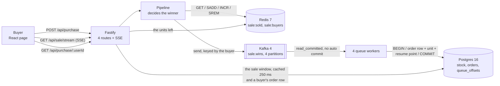

# Flash sale

One product has 1,000 units, a start time, and an end time. Thousands of buyers arrive at once, and each buyer may take one unit. Each unit sells once.

The stack is TypeScript on Node 24, and Fastify runs the API. Redis 7 handles the decision while Kafka 4 handles the queue. Postgres 16 keeps the permanent record, and React 19 builds the page.

## Run it

You need Node 24 or newer and Docker.

```sh
cp .env.example .env     # ports and addresses only
npm install
npm run db:up            # Postgres, Redis and Kafka in Docker
npm run build            # type checks 3 workspaces, and builds the page
npm start                # migrates the database, then serves on :3000
```

Open `http://127.0.0.1:3000`. Because one server serves both the page and the API, there is no CORS.

The sale is one row in the database, and the file `server/sql/migrations/0002_campaign.sql` writes 1,000 units with a start in 2026 and an end in 2036. The sale is open the moment you start. Edit that file to see the other states.

Run `npm run db:migrate`. The command `npm start` also runs the migrations, and a fresh clone needs no extra step.

`.env` holds addresses and sizes only, and Postgres, Redis or Kafka may already run on your machine. If so, change `POSTGRES_PORT`, `REDIS_PORT` or `KAFKA_PORT`, and change the URL beside it.

`npm test` runs all 66 tests. The 23 unit tests each check one module and use no container, and you run them with `npm run test:unit`. They finish in about a second, even with Docker stopped.

The 43 integration tests use real Postgres, Redis and Kafka through testcontainers, and nothing is mocked. Docker must be running when you run them with `npm run test:integration`.

`npm run dev` runs the server and Vite together. Vite serves the page on `http://127.0.0.1:5173` and also sends `/api` requests to the server.

`npm run db:down` removes the container and its data. Stop the server first. If the server keeps running after its broker is gone, it keeps a producer sequence that the new broker never issued. Every send then fails with `out of order sequence number`, and the failures continue until you restart the server.

## Run the stress test

```sh
npm start                # in one terminal
npm run stress           # in another
```

The script empties the sale and orders tables, then drives **10,000 buyers over 500 connections**. It deletes rows. Run it only against localhost.

The run fails on any other outcome:

```
queue drained in 567 ms
ok  won           1000  (want 1000)
ok  sold-out      9000  (want 9000)
ok  other            0  (want 0)
ok  units left       0  (want 0)
ok  pg orders     1000  (want 1000)

10000 buyers over 500 connections in 1.30 s
7703 purchase requests a second
4 Postgres backends at the peak, for 500 open sockets

PASS
```

`queue drained in 567 ms` is the wait between the last buyer answered and the last order row written: Redis answers the buyer first, and a worker writes the row to Postgres later.

`4 Postgres backends` is the peak for 500 open sockets where `DB_POOL_MAX` is 20, and only workers and page reads use the pool. The buyer path skips it. See [Scaling](#scaling).

`npm run bench` measures throughput with autocannon, but it skips count checks. Autocannon reads its `amount` as a per-connection quota.

## How it works


The picture above shows the path a purchase takes, and `GET /api/sale` also reads data. It asks `Pipeline` for the units left and asks the pool for the sale window. `Pipeline` is Redis, and the pool is Postgres. The flowchart below shows those 2 reads and names the call on each arrow.

<details>
<summary>Mermaid source of the same system, with the read paths and the call on each arrow</summary>



</details>

`mermaid-cli` renders `diagrams/architecture.svg` from `diagrams/architecture.mmd` and uses the Iconify `logos` and `mdi` packs. Because GitHub does not register those icon packs when it renders Mermaid `architecture-beta` blocks, the icons show up as broken placeholders. The repository stores the rendered SVG. The Mermaid source beside it lets a reader diff or change the diagram as text.

Three places hold the state, each with one job.

| Place | Holds | Why it is there |
| --- | --- | --- |
| Redis 7 | `sale:sold` and `sale:buyers` | It answers the buyer. Redis runs one command at a time, so `INCR` never hands two buyers the same place. |
| Kafka 4 | `sale.wins`, 4 partitions | It carries each win, so the buyer waits for no database write. |
| Postgres 16 | `stock`, `orders` and `queue_offsets` | It is the permanent record, and the only store that must survive a restart. |

Redis answers the buyer in 4 commands at most, and `Pipeline.reserve` in `server/src/queue/pipeline.ts` runs them in this order. It stops at the first refusal.

1. `GET sale:sold`. If the count already reached the stock, the buyer reads `sold-out` and nothing is written anywhere.
2. `SADD sale:buyers`. If the member was already in the set, the buyer holds a unit, and the answer is `already-bought`.
3. `INCR sale:sold`. The number it returns is the buyer's place in the queue. Because Redis runs one command at a time, two buyers never get the same number.
4. `SREM sale:buyers`, only if that place passed the stock. The loser holds nothing, and the set has no reason to remember them.

Kafka gets one record for a winner's place, and the buyer is the key.

`SADD` in step 2 is the only "one unit for each buyer" check on the fast path. Redis runs each command as one unit, so two parallel attempts by one buyer can never both read 1.

Without `SADD`, a repeat buyer reaches `INCR`, and the counter then drops a unit for a buyer who already holds one. Postgres still refuses the second order row at `UNIQUE (user_id)`. Nobody gets two units. But the count loses that unit, and the sale reads sold out with fewer than 1,000 order rows.

The set grows with the stock. Step 4 is the reason.

A run with 30,000 buyers against 1,000 units held 1,000 members and 47,504 bytes of Redis memory, but the same run without step 4 held 30,000 members and 1,461,456 bytes. The second run used 30.8 times more memory.

In a flash sale, the crowd size is the number nobody can predict.

A worker writes the permanent state: `Gate.record` in `server/src/gate/gate.ts` writes the order row, takes the unit and moves the queue resume point, and it does all three in one Postgres transaction.

The lookup can lag behind the purchase answer. Because `GET /api/purchase/:userId` reads Postgres only, a buyer told `won` can briefly read `held: false` until a worker writes their row. I measured 12 runs of 1,000 wins each, and the last row landed 566 ms to 3,285 ms after the last buyer got an answer. The page does not need that route for the purchase result. `POST /api/purchase` already carries the outcome.

The server has 4 routes.

| Route | Answers |
| --- | --- |
| `GET /api/sale` | `pending`, `open`, `sold-out` or `closed`, and the units left |
| `GET /api/sale/stream` | the same, pushed over server-sent events whenever it changes |
| `POST /api/purchase` | one of `won`, `already-bought`, `sold-out`, `not-open`, `over` |
| `GET /api/purchase/:userId` | whether that buyer holds a unit, and when they got it |

One ticker serves every open page: each tick, it reads the state once and then writes to each open socket. 1,000 pages cost 1 read.

The state read costs no database round trip. `GET /api/sale` takes the units left from Redis, and it takes the sale window from a read of `stock` that `Gate` reuses for 250 ms. Because the window never changes while the sale runs, a stale copy cannot be wrong.

## Why no unit is oversold

Three places refuse, and each one refuses a different thing.

Redis decides the winner: `INCR sale:sold` returns a unique number on each call, 1, then 2, and so on. Redis runs one command at a time. So 10,000 buyers that arrive together get 10,000 different numbers, and a buyer whose number passes the stock is refused and removed from the set. No lock and no transaction exist.

Kafka carries each win once, in order for one buyer. The record key is the buyer. One buyer always lands on one partition, and one partition keeps its order. The producer runs idempotent with `acks: all`, so a retried send writes one record. The consumer reads `read_committed`.

Postgres refuses the oversell a second time. `Gate.record` runs one transaction that stops at the first statement that refuses.

1. `INSERT INTO queue_offsets ... ON CONFLICT DO NOTHING`, then
   `SELECT next_offset ... FOR UPDATE`. Every path takes this lock first. Two workers on one
   partition run one after the other. The lock deadlocked against the stock row when it came second. That deadlock showed up at 100 parallel records.
2. `INSERT INTO orders (user_id, seq) ... ON CONFLICT (user_id) DO NOTHING RETURNING user_id`. If no row comes back, the database already holds a record for that buyer. The record is a repeat. It takes no second unit from the count.
3. `UPDATE stock SET units_left = units_left - 1 WHERE id = 1 AND units_left > 0 RETURNING
   units_left`. If no row comes back, the database holds fewer units than the queue holds wins. That is the oversell the statement refuses.

A commit writes the order row, the decrement, and the new resume point together. A rollback writes none of them.

[`docs/decisions.md`](docs/decisions.md#what-the-queue-worker-guarantees) covers repeats, crashes and arrival order.

Four guards protect the count.

| Guard | Where | What it refuses |
| --- | --- | --- |
| `INCR` past the stock | `Pipeline.reserve` | the oversell, before the queue |
| `AND units_left > 0` | the `UPDATE` above | the oversell, a second time |
| `UNIQUE (user_id)` | `orders_user_id_key` | a second unit for one buyer, and a record read twice |
| `CHECK (units_left >= 0)` | `stock_never_negative` | a future defect, as a failed transaction |

The last two guards are in `server/sql/migrations/0001_tables.sql`, and each guard has a test in `server/test/integration/schema.spec.ts` that tries to break it. If the worker fails, the database rolls back the transaction. The stock stays intact.

## Why there is no Redis transaction

`Pipeline.reserve` uses no `MULTI`, no `WATCH` and no Lua script. Each decision is already one atomic Redis command, so the pipeline needs no transaction. [`docs/decisions.md`](docs/decisions.md#why-there-is-no-redis-transaction) has the full argument.

## What happens when something breaks

Each row is a fault that the team injected and measured. The full record of all 21 runs is in the fault table at [`docs/design-experiments.md`](docs/design-experiments.md#every-fault-and-what-it-read).

| What breaks | What the buyer gets | What the record shows |
| --- | --- | --- |
| Postgres stops | The buyer still wins in Redis, and the win waits in Kafka | the order rows held all 1,000 wins after the restart. `server/test/integration/routes.spec.ts` asserts the 500 while it is down |
| The Postgres link adds 2 s of delay | The answer is unchanged, and the drain takes longer | 1,000 order rows, at 1,740 decisions a second |
| The server is killed mid-sale | No unit comes back | the count is rebuilt from the order rows |
| Redis is lost | The counter is rebuilt from `max(seq)` | 1,000 buyers, rebuilt exactly, in 4 ms |
| 1 of 4 workers is killed while the queue drains | No row is lost, and no row is written twice | 0 rows lost, 0 rows doubled |

## Measured

The box has an Intel Core Ultra 9 275HX, 24 cores, 62 GB RAM and Node 24.11.1, and Postgres 16, Redis 7 and Kafka 4 run in Docker. Every number below names the command that produced it.

`p50` is the middle response time, and half the requests are faster than it. `p99` is the time that only the slowest 1 in 100 requests exceed.

| Measure | Number | Command |
| --- | --- | --- |
| Buyers, and the units they took | 10,000 buyers, exactly 1,000 won | `npm run stress` |
| Time for all 10,000 | 1.19 s to 1.48 s over 19 runs, so 6,750 to 8,380 a second | `npm run stress` |
| Postgres backends at the peak | 4, for 500 open sockets | `npm run stress` |
| The queue drain | every one of the 1,000 order rows landed, 566 ms to 3,285 ms after the last buyer was answered | `npm run stress` |
| `GET /api/sale` throughput | 31,991 a second, p50 13 ms, p99 51 ms | `npm run bench` |
| `POST /api/purchase` throughput | 33,274 a second, p50 13 ms, p99 31 ms | `npm run bench` |
| Errors and non-2xx under load | 0 and 0 | `npm run bench` |
| Tests | 66 over 11 files: 23 unit, 43 integration against real Postgres, Redis and Kafka | `npm test` |

The purchase route is as fast as the read route. Redis answers both, but the earlier version opened a Postgres transaction on every purchase and ran at 11,529 a second. Redis raised the refusal path by 2.9 times.

`npm run bench` drives one repeat buyer against a sold-out sale and measures the refusal path only. `npm run stress` measures the winning path at 6,750 to 8,380 a second, and that number includes the Kafka send.

The load generator and the server run on the same 24 cores, and the server is one Node process with no cluster and no tuning. Every number is a floor.

## Scaling

[`docs/design-experiments.md`](docs/design-experiments.md#scaling) lists every bottleneck, and each entry gives the measurement that found it and the change that moves it. It names PgBouncer, N stock rows, more API processes, a waiting room, and more partitions.

## Why Redis, a queue and a database

We built nine designs and measured each against the same 10,000 buyers. [`docs/design-experiments.md`](docs/design-experiments.md#why-redis-a-queue-and-a-database) has the table and also explains why this design wins on shape, even though two of the nine answer faster.

## Trade-offs

Three stores split the work, and each one fails on its own. Redis decides who wins, Kafka carries the orders, and Postgres records them. The buyer does not wait for a database write. Arrival spikes land in a log. A slow database only adds drain time.

The cost is two more containers, and there is also a window where Redis holds a win that Postgres does not yet have. Both costs are measured in [`docs/design-experiments.md`](docs/design-experiments.md#why-redis-a-queue-and-a-database).

Four Redis commands make the decision, with no Lua script and no transaction. A Lua script is atomic, but it is a second language that no type checker reads. `SADD` before `INCR` leaves one gap: a buyer is in the set before their place is known, and `SREM` closes that gap in the same function. The whole decision stays in TypeScript. [Why there is no Redis transaction](#why-there-is-no-redis-transaction) gives the argument, while `server/test/integration/pipeline.spec.ts` gives the proof.

Postgres handles the storage. SQLite would work for 1,000 rows written by one process, and it needs no container. A real sale uses Postgres anyway. Then the design does not change when the sale grows. The cost is one container.

Nothing is mocked: the database is real Postgres. A run starts it in Docker, and a test starts it through testcontainers. The code does not change when the database moves to a managed instance.

The page receives server-sent events. The server pushes a message down one open connection, and the page never asks for it. Because the page needs one direction only, a WebSocket would add nothing. Server-sent events reconnect by themselves and are also plain HTTP.

Two npm workspaces hold the code in one repository. `server/` and `web/` build and test from one root. One `npm ci` and one `npm test` cover both. The root `package.json` holds scripts that start other scripts, so a reader must open that file to see what `npm test` runs. That is the cost.

Some things are missing on purpose: there is no authentication. A username or an email is the whole identity a flash sale needs. There is no payment, no deployment and no rate limit. A real sale needs a rate limit, but this project does not claim to be a real sale.

## Layout

```
server/   Fastify, the Redis pipeline, the Postgres gate, the migrations, 53 tests
web/      React 19 on Vite, 13 tests
stress/   the correctness run, and the throughput bench
```

| File at the root | What it is |
| --- | --- |
| `diagrams/architecture.mmd`, `diagrams/architecture.svg` | the system today, as source and as image |
| `diagrams/architecture-scale.mmd`, `diagrams/architecture-scale.svg` | the target shape at a much larger load |
| `docker-compose.yml` | Postgres 16, Redis 7 with `appendfsync everysec`, and Kafka 4 in KRaft mode, where Kafka keeps its own metadata and needs no ZooKeeper |
| `.env.example` | every address and size the server reads, with no constant hidden in source |
| `server/sql/migrations/` | the tables, then the campaign row. `npm start` and `npm run db:migrate` both apply them, once each |
| `docs/design-experiments.md` | the 9 designs that were built and measured, and why this one ships |

## What the sale does, and where

| Capability | Where it lives |
| --- | --- |
| A configurable start and end time, and purchases only inside it | `start_at` and `end_at` in the `stock` row, written by `server/sql/migrations/0002_campaign.sql`. The server checks them before it reads any store. `server/test/integration/pipeline.spec.ts` |
| One product with a fixed quantity | one row in `stock`, with `CHECK (units_left >= 0)` and a single-row constraint |
| One unit per user | `SADD sale:buyers` refuses the second attempt, and `UNIQUE (user_id)` on `orders` refuses it again. `server/test/integration/schema.spec.ts` |
| An endpoint for the sale state | `GET /api/sale`, and `GET /api/sale/stream` for the live form. A buyer sees 3 states: upcoming (`pending`), active (`open`) and ended (`sold-out` or `closed`). The sale splits "ended" in two so the buyer knows whether the units ran out or the clock did |
| An endpoint to attempt a purchase | `POST /api/purchase` |
| An endpoint for what a buyer holds | `GET /api/purchase/:userId` reads Postgres, so a fresh win lags by the drain time |
| A simple frontend with a state line, an identifier field, a Buy Now button and feedback | `web/`, React 19. The page names all 5 outcomes and updates with no reload |
| A clear system diagram | `diagrams/architecture.svg` at the top of How it works, with its source beside it |
| High throughput, and a design that scales | the Measured and Scaling sections. Each number names its command. The write is already off the request path |
| Robustness and fault tolerance | a slow database costs drain time and no answers. A rolled-back transaction writes no order. A lost Redis is rebuilt from the order rows, and `max(seq)` gives the next place, never the row count |
| Concurrency control, with no overselling | `INCR` in Redis, then the row lock in the `UPDATE`, proved by the 10,000-buyer run and by 21 injected faults |
| Unit and integration tests | 23 unit tests in `server/test/unit/` and `web/test/unit/`, run by `npm run test:unit`. 43 integration tests in `server/test/integration/` and `web/test/integration/`, run by `npm run test:integration` against real Postgres, Redis and Kafka through testcontainers |
| Stress tests, and an explanation of the results | `npm run stress` for the counts, `npm run bench` for the speed, and the Measured section for the reading |
| TypeScript, Node with Fastify, React | all three, type checked by `npm run build` |
| Ready for managed services | every store is a managed product, and nothing is mocked. `docs/design-experiments.md` holds the 9 measured designs. The Scaling section holds the target picture |
