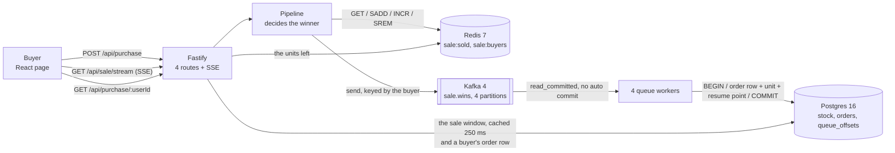

# Flash sale

One product, 1,000 units, a start time and an end time. Thousands of buyers arrive at once, and each one may take one unit. No unit is sold twice.

TypeScript on Node 24. Fastify for the API, Redis 7 for the decision, Kafka 4 for the queue, Postgres 16 for the permanent record, React 19 for the page.

## Run it

You need Node 24 or newer and Docker.

```sh
cp .env.example .env     # ports and addresses only
npm install
npm run db:up            # Postgres, Redis and Kafka in Docker
npm run build            # type checks 3 workspaces, and builds the page
npm start                # migrates the database, then serves on :3000
```

Open `http://127.0.0.1:3000`. The same server serves the page and the API, so there is one URL and no CORS.

**The sale is a row, and never a variable.** `server/sql/migrations/0002_campaign.sql` writes 1,000 units, a start in 2026 and an end in 2036. The sale is open the moment you start. Edit that file to see the other states. Run `npm run db:migrate`. `npm start` runs the migrations too, so a fresh clone needs no extra step.

`.env` holds addresses and sizes only. If Postgres, Redis or Kafka already runs on your machine, change `POSTGRES_PORT`, `REDIS_PORT` or `KAFKA_PORT`, and the URL beside it.

**Tests.** `npm test` runs all 66. The tests use real Postgres, Redis and Kafka through testcontainers, so Docker must be running. Nothing is mocked.

**While you develop.** `npm run dev` runs the server and Vite together. Vite serves the page on `http://127.0.0.1:5173` and sends `/api` to the server.

**Stop.** `npm run db:down` removes the container and its data. Stop the server first. A server that outlives its broker keeps a producer sequence the new broker never issued. Every send then fails with `out of order sequence number` until you restart the server.

## Run the stress test

```sh
npm start                # in one terminal
npm run stress           # in another
```

The script empties the sale and orders tables, then drives **10,000 buyers over 500 connections**. It refuses to run against any host but localhost, because it truncates a table.

The run fails on any other outcome:

```
queue drained in 567 ms
ok  won           1000  (want 1000)
ok  sold-out      9000  (want 9000)
ok  other            0  (want 0)
ok  units left       0  (want 0)
ok  pg orders     1000  (want 1000)

10000 buyers over 500 connections in 1.30 s
7703 purchase requests a second
4 Postgres backends at the peak, for 500 open sockets

PASS
```

`queue drained in 567 ms` is the wait between the last buyer answered and the last order row written. Redis answers the buyer first. A worker writes Postgres later.

`4 Postgres backends` is the peak for 500 open sockets. `DB_POOL_MAX` is 20. The buyer path never asks the pool for a connection, so only workers and page reads do. See [Scaling](#scaling).

`npm run bench` measures throughput with autocannon. It never checks a count, because autocannon reads its `amount` as a per-connection quota.

## How it works


The picture above draws the path a purchase takes. `GET /api/sale` reads too: it asks `Pipeline` for the units left, which is Redis, and the pool for the sale window, which is Postgres. The flowchart below draws those 2 reads and names the call on each arrow.

<details>
<summary>The same system as Mermaid source, with the read paths and the call on each arrow</summary>



</details>

`mermaid-cli` renders `diagrams/architecture.svg` from `diagrams/architecture.mmd` with the Iconify `logos` and `mdi` packs. GitHub renders Mermaid `architecture-beta` blocks but does not register those icon packs. The icons arrive as broken placeholders, so the repository stores the rendered SVG. The Mermaid source sits beside it, so a reader can diff and change the diagram as text.

**Three places, and each one does one job.**

| Place | Holds | Why it is there |
| --- | --- | --- |
| Redis 7 | `sale:sold` and `sale:buyers` | It answers the buyer. Redis runs one command at a time, so `INCR` never hands two buyers the same place. |
| Kafka 4 | `sale.wins`, 4 partitions | It carries each win, so the buyer waits for no database write. |
| Postgres 16 | `stock`, `orders` and `queue_offsets` | It is the permanent record, and the only store that must survive a restart. |

**Redis answers the buyer in 4 commands at most.** `Pipeline.reserve` in `server/src/queue/pipeline.ts` runs them in this order, and it stops at the first refusal.

1. `GET sale:sold`. Where the count already reached the stock, the buyer reads `sold-out` and
   nothing is written anywhere.
2. `SADD sale:buyers`. A member that was already there means the buyer holds a unit, so the answer
   is `already-bought`.
3. `INCR sale:sold`. The number it returns is the buyer's place in the queue. Two buyers never get
   the same number, because Redis runs one command at a time.
4. `SREM sale:buyers`, and only where that place passed the stock. The loser holds nothing, so the
   set keeps no reason to remember them.

A winner's place then travels to Kafka in one record, keyed by the buyer.

**Why step 2 is there at all.** `SADD` is the only "one unit for each buyer" check on the fast path. The command is atomic, so two parallel attempts by one buyer can never both read 1. Without `SADD`, a repeat buyer reaches `INCR`, and the counter drops a unit for a buyer who already holds one. Postgres still refuses the second order row at `UNIQUE (user_id)`, so nobody gets two units. But the unit is gone from the count, so the sale reads sold out with fewer than 1,000 order rows.

**The set grows with the stock, and never with the traffic.** Step 4 is the reason. 30,000 buyers against 1,000 units left 1,000 members and 47,504 bytes of Redis memory. The same run without step 4 held 30,000 members and 1,461,456 bytes, which is 30.8 times more. A design that keeps every buyer grows with the crowd. In a flash sale, the crowd size is the number nobody can predict.

**A worker writes the permanent state.** `Gate.record` in `server/src/gate/gate.ts` writes the order row, takes the unit and moves the queue resume point, all in one Postgres transaction.

**The lookup lags the answer.**
`GET /api/purchase/:userId` reads Postgres only. A buyer told `won` can read `held: false` for a moment, until a worker writes their row. Measured over 12 runs of 1,000 wins: the last row landed 566 ms to 3,285 ms after the last buyer was answered. The page does not depend on that route for the purchase result, because `POST /api/purchase` already carries the outcome.

**The 4 routes.**

| Route | Answers |
| --- | --- |
| `GET /api/sale` | `pending`, `open`, `sold-out` or `closed`, and the units left |
| `GET /api/sale/stream` | the same, pushed over SSE whenever it changes |
| `POST /api/purchase` | one of `won`, `already-bought`, `sold-out`, `not-open`, `over` |
| `GET /api/purchase/:userId` | whether that buyer holds a unit, and when they got it |

One ticker serves every open page. It reads the state once per tick and writes to each open socket, so 1,000 pages cost 1 read and not 1,000.

**The state read costs no database round trip either.** `GET /api/sale` takes the units left from Redis, and the sale window from a read of `stock` that `Gate` reuses for 250 ms. The window never changes while the sale runs, so a stale copy of it cannot be wrong.

## Why no unit is oversold

Three places refuse, and each one refuses a different thing.

**1. Redis decides the winner.** `INCR sale:sold` returns 1, then 2, and never the same number twice. Redis runs one command at a time, so 10,000 buyers that arrive together get 10,000 different numbers. A buyer whose number passes the stock is refused. That buyer is removed from the set. No lock and no transaction exist.

**2. Kafka carries each win once, and in order for one buyer.** The record key is the buyer, so one buyer always lands on one partition. One partition keeps its order. The producer runs idempotent with `acks: all`, so a retried send writes one record. The consumer reads `read_committed`.

**3. Postgres refuses the oversell a second time.** `Gate.record` runs one transaction. The transaction stops at the first statement that refuses.

1. `INSERT INTO queue_offsets ... ON CONFLICT DO NOTHING`, then
   `SELECT next_offset ... FOR UPDATE`. Every path takes this lock first, so two workers on one
   partition run one after the other. Taking it second deadlocked against the stock row, measured at
   100 parallel records.
2. `INSERT INTO orders (user_id, seq) ... ON CONFLICT (user_id) DO NOTHING RETURNING user_id`. No
   returned row means that buyer is already recorded. The record is a repeat and no second unit
   leaves the count.
3. `UPDATE stock SET units_left = units_left - 1 WHERE id = 1 AND units_left > 0 RETURNING
   units_left`. No returned row means the database holds fewer units than the queue holds wins.
   That is the oversell the statement refuses.

A commit writes the order row, the decrement and the new resume point together. A rollback writes none of them.

**How a repeat, a crash and the arrival order are handled** is in [`docs/decisions.md`](docs/decisions.md#what-the-queue-worker-guarantees).

**Four guards, and the Redis one is only the first.**

| Guard | Where | What it refuses |
| --- | --- | --- |
| `INCR` past the stock | `Pipeline.reserve` | the oversell, before the queue |
| `AND units_left > 0` | the `UPDATE` above | the oversell, a second time |
| `UNIQUE (user_id)` | `orders_user_id_key` | a second unit for one buyer, and a record read twice |
| `CHECK (units_left >= 0)` | `stock_never_negative` | a future defect, as a failed transaction |

The last two guards are in `server/sql/migrations/0001_tables.sql`. `server/test/schema.spec.ts` proves each one by trying to break it. A defect in the worker then costs a rolled-back transaction, never a sold unit.

## Why there is no Redis transaction

`Pipeline.reserve` opens no `MULTI`, takes no `WATCH` and runs no Lua script. Each decision is already one command, and one Redis command is atomic. The full reason is in [`docs/decisions.md`](docs/decisions.md#why-there-is-no-redis-transaction).

## What happens when something breaks

Each row is a fault that was injected and measured. The id names the run in
[`docs/design-experiments.md`](docs/design-experiments.md).

| What breaks | What the buyer gets | What the record shows |
| --- | --- | --- |
| Postgres stops | The buyer still wins in Redis, and the win waits in Kafka | F15: the order rows held all 1,000 wins after the restart. `server/test/routes.spec.ts` asserts the 500 while it is down |
| The Postgres link adds 2 s of delay | The answer is unchanged, and the drain takes longer | F4: 1,000 order rows, at 1,740 decisions a second |
| The server is killed mid-sale | No unit comes back | F2: the count is rebuilt from the order rows |
| Redis is lost | The counter is rebuilt from `max(seq)`, and never from the row count | F19: 1,000 buyers, rebuilt exactly, in 4 ms |
| 1 of 4 workers is killed while the queue drains | Nothing is lost, and nothing is written twice | F20: 0 rows lost, 0 rows doubled |

16 more faults were injected. The record of each one is in that document.

## Measured

On this box: Intel Core Ultra 9 275HX, 24 cores, 62 GB RAM, Node 24.11.1, and Postgres 16, Redis 7
and Kafka 4 in Docker. Every number below names the command that produced it.

| Measure | Number | Command |
| --- | --- | --- |
| Buyers, and the units they took | 10,000 buyers, exactly 1,000 won | `npm run stress` |
| Time for all 10,000 | 1.19 s to 1.48 s over 19 runs, so 6,750 to 8,380 a second | `npm run stress` |
| Postgres backends at the peak | 4, for 500 open sockets | `npm run stress` |
| The queue drain | every one of the 1,000 order rows landed, 566 ms to 3,285 ms after the last buyer was answered | `npm run stress` |
| `GET /api/sale` throughput | 31,991 a second, p50 13 ms, p99 51 ms | `npm run bench` |
| `POST /api/purchase` throughput | 33,274 a second, p50 13 ms, p99 31 ms | `npm run bench` |
| Errors and non-2xx under load | 0 and 0 | `npm run bench` |
| Tests | 66 over 11 files, against real Postgres, Redis and Kafka | `npm test` |

**The purchase route is as fast as the read route.** Both are answered by Redis. The earlier version opened a Postgres transaction on every purchase and ran at 11,529 a second. Redis raised the refusal path by 2.9 times.

**What the two bench numbers do not cover.** `npm run bench` drives one repeat buyer against a sold-out sale, so it measures the refusal path only. `npm run stress` measures the winning path: 6,750 to 8,380 a second. That number includes the Kafka send.

**What the numbers do not mean.** The load generator and the server share 24 cores, so every number is a floor. There is one Node process and no cluster. Nothing is tuned.

## Scaling

Every bottleneck, with the measurement that found it and the change that moves it, is in [`docs/design-experiments.md`](docs/design-experiments.md#scaling). It names PgBouncer, N stock rows, more API processes, a waiting room, and more partitions.

## Why Redis, a queue and a database

Nine designs were built and measured against the same 10,000 buyers. The table, and the reason this one wins on shape and not on speed, are in [`docs/design-experiments.md`](docs/design-experiments.md#why-redis-a-queue-and-a-database).

## Trade-offs

**Three stores, and each one fails on its own.** Redis decides, Kafka carries, Postgres records. The buyer never waits for a database write. An arrival spike lands in a log, not a connection pool. A slow database costs drain time, not answers. The cost is two more containers and a window where Redis holds a win that Postgres does not. Both costs are measured in [`docs/design-experiments.md`](docs/design-experiments.md#why-redis-a-queue-and-a-database).

**Four Redis commands, and no Lua script and no transaction.** A Lua script is atomic, but it is a second language that no type checker reads. `SADD` before `INCR` leaves one gap, where a buyer is in the set before their place is known. `SREM` closes the gap in the same function. The whole decision stays in TypeScript. [Why there is no Redis transaction](#why-there-is-no-redis-transaction) gives the argument, and `server/test/pipeline.spec.ts` gives the proof.

**Postgres, and not SQLite.** For 1,000 rows written by one process, SQLite is enough and it needs no container. Postgres is here because a real sale uses it, so the design does not change when the sale grows. The cost is one container.

**Nothing is mocked.** The database is real Postgres, in Docker for a run and started by testcontainers for a test. The code does not change when it moves to a managed instance.

**Server-sent events, and not polling.** The page needs one direction only, so a WebSocket buys nothing. SSE reconnects by itself, and it is plain HTTP.

**Two npm workspaces, and not two repositories.** `server/` and `web/` build and test from one root. One `npm ci` and one `npm test` cover both. The cost: the root `package.json` holds scripts that fan out, so a reader must open it to see what `npm test` runs.

**What is deliberately absent.** No authentication, because a username or an email is the whole identity a flash sale needs. No payment. No deployment. No rate limit, which a real sale needs and this one does not claim.

## Layout

```
server/   Fastify, the Redis pipeline, the Postgres gate, the migrations, 53 tests
web/      React 19 on Vite, 13 tests
stress/   the correctness run, and the throughput bench
```

| File at the root | What it is |
| --- | --- |
| `diagrams/architecture.mmd`, `diagrams/architecture.svg` | the system today, as source and as image |
| `diagrams/architecture-scale.mmd`, `diagrams/architecture-scale.svg` | the target shape at a much larger load |
| `docker-compose.yml` | Postgres 16, Redis 7 with `appendfsync everysec`, and Kafka 4 in KRaft mode |
| `.env.example` | every address and size the server reads, with no constant hidden in source |
| `server/sql/migrations/` | the tables, then the campaign row. `npm start` and `npm run db:migrate` both apply them, once each |
| `docs/design-experiments.md` | the 9 designs that were built and measured, and why this one ships |

## What the sale does, and where

| Capability | Where it lives |
| --- | --- |
| A configurable start and end time, and purchases only inside it | `start_at` and `end_at` in the `stock` row, written by `server/sql/migrations/0002_campaign.sql`. The server checks them before it reads any store. `server/test/pipeline.spec.ts` |
| One product with a fixed quantity | one row in `stock`, with `CHECK (units_left >= 0)` and a single-row constraint |
| One unit per user | `SADD sale:buyers` refuses the second attempt, and `UNIQUE (user_id)` on `orders` refuses it again. `server/test/schema.spec.ts` |
| An endpoint for the sale state | `GET /api/sale`, and `GET /api/sale/stream` for the live form. A buyer sees 3 states: upcoming (`pending`), active (`open`) and ended (`sold-out` or `closed`). The sale splits "ended" in two so the buyer knows whether the units ran out or the clock did |
| An endpoint to attempt a purchase | `POST /api/purchase` |
| An endpoint for what a buyer holds | `GET /api/purchase/:userId` reads Postgres, so a fresh win lags by the drain time |
| A simple frontend with a state line, an identifier field, a Buy Now button and feedback | `web/`, React 19. The page names all 5 outcomes and updates with no reload |
| A clear system diagram | `diagrams/architecture.svg` at the top of How it works, with its source beside it |
| High throughput, and a design that scales | the Measured and Scaling sections. Each number names its command. The write is already off the request path |
| Robustness and fault tolerance | a slow database costs drain time and no answers. A rolled-back transaction writes no order. A lost Redis is rebuilt from the order rows, and `max(seq)` gives the next place, never the row count |
| Concurrency control, with no overselling | `INCR` in Redis, then the row lock in the `UPDATE`, proved by the 10,000-buyer run and by 20 injected faults |
| Unit and integration tests | 66 tests over 11 files, against real Postgres, Redis and Kafka through testcontainers. `web/test/flow.spec.tsx` drives the page through the real HTTP client |
| Stress tests, and an explanation of the results | `npm run stress` for the counts, `npm run bench` for the speed, and the Measured section for the reading |
| TypeScript, Node with Fastify, React | all three, type checked by `npm run build` |
| Ready for managed services | every store is a managed product, and nothing is mocked. `docs/design-experiments.md` holds the 9 measured designs. The Scaling section holds the target picture |
