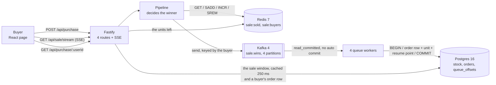

# Flash sale

One product, 1,000 units, a start time and an end time. Thousands of buyers arrive at once, and each
one may take one unit. No unit is ever sold twice.

TypeScript on Node 24. Fastify for the API, Redis 7 for the decision, Kafka 4 for the queue,
Postgres 16 for the permanent record, React 19 for the page.

## Run it

You need Node 24 or newer and Docker.

```sh
cp .env.example .env     # the port, the stock and the sale window
npm install
npm run db:up            # Postgres, Redis and Kafka in Docker
npm run build            # type checks 3 workspaces, and builds the page
npm start                # the server on :3000
```

Open `http://127.0.0.1:3000`. The page is served by the same server as the API, so there is one URL
and no CORS.

`.env.example` opens the sale in 2026 and closes it in 2036, so the sale is open the moment you
start. Change `SALE_START` and `SALE_END` to see the other states. Where Postgres already runs on
your box, change `POSTGRES_PORT` and the `DATABASE_URL` beside it.

**Tests.** `npm test` runs all 53. Postgres, Redis and Kafka are all real, started by
testcontainers, so Docker must be running. Nothing is mocked.

**While you develop.** `npm run dev` runs the server and Vite together. Vite serves the page on
`http://127.0.0.1:5173` and sends `/api` to the server.

**Stop.** `npm run db:down` removes the container and its data.

## Run the stress test

```sh
npm start                # in one terminal
npm run stress           # in another
```

It empties the sale and the orders table, then drives **10,000 buyers over 500 connections**. It
refuses to run against any host but localhost, because it truncates a table.

Expected outcome, and the run fails loudly on any other:

```
queue drained in 567 ms
ok  won           1000  (want 1000)
ok  sold-out      9000  (want 9000)
ok  other            0  (want 0)
ok  units left       0  (want 0)
ok  pg orders     1000  (want 1000)

10000 buyers over 500 connections in 1.30 s
7703 purchase requests a second
4 Postgres backends at the peak, for 500 open sockets

PASS
```

Two lines are worth reading twice. `queue drained in 567 ms` is the wait between the last buyer
answered and the last order row written, because Redis answers the buyer and a worker writes
Postgres later. `4 Postgres backends` is the peak for 500 open sockets, and `DB_POOL_MAX` is 20. The
buyer path never asks the pool for anything, so only the workers and the page reads do. See
[Scaling](#scaling).

`npm run bench` is the other half. It measures throughput with autocannon and it never checks a
count, because autocannon reads its `amount` as a per-connection quota.

## How it works


<details>
<summary>The same diagram as Mermaid source, with the call on each arrow</summary>



</details>

`diagrams/architecture.svg` is rendered from `diagrams/architecture.mmd` by `mermaid-cli` with the Iconify `logos` and
`mdi` packs. The picture is committed, because GitHub renders a Mermaid `architecture-beta` block but
does not register those icon packs, so the icons arrive as broken placeholders. The source sits
beside it, so the diagram stays a text file that a reviewer can diff and change.

**Three places, and each one does one job.**

| Place | Holds | Why it is there |
| --- | --- | --- |
| Redis 7 | `sale:sold` and `sale:buyers` | It answers the buyer. Redis runs one command at a time, so `INCR` never hands two buyers the same place. |
| Kafka 4 | `sale.wins`, 4 partitions | It carries each win, so the buyer waits for no database write. |
| Postgres 16 | `stock`, `orders` and `queue_offsets` | It is the permanent record, and the only store that must survive a restart. |

**The buyer is answered in Redis, in 4 commands at most.** `Pipeline.reserve` in
`server/src/queue/pipeline.ts` runs them in this order, and it stops at the first refusal.

1. `GET sale:sold`. Where the count already reached the stock, the buyer reads `sold-out` and
   nothing is written anywhere.
2. `SADD sale:buyers`. A member that was already there means the buyer holds a unit, so the answer
   is `already-bought`.
3. `INCR sale:sold`. The number it returns is the buyer's place in the queue. Two buyers never get
   the same number, because Redis runs one command at a time.
4. `SREM sale:buyers`, and only where that place passed the stock. The loser holds nothing, so the
   set keeps no reason to remember them.

A winner's place then travels to Kafka in one record, keyed by the buyer.

**The set grows with the stock, and never with the traffic.** Step 4 is the reason. 30,000 buyers
against 1,000 units left 1,000 members and 47,504 bytes of Redis memory. The same run without step 4
held 30,000 members and 1,461,456 bytes, which is 30.8 times more. A design that keeps every buyer
is sized by the crowd, and a flash sale is the one event where the crowd is the number you cannot
predict.

**A worker writes the permanent state.** `Gate.record` in `server/src/gate/gate.ts` writes the order
row, takes the unit and moves the queue resume point, all in one Postgres transaction.

**The lookup lags the answer.**
`GET /api/purchase/:userId` reads Postgres only. So a buyer told `won` can read `held: false` for a
moment, until a worker writes their row. Measured over 12 runs of 1,000 wins: the last row landed
566 ms to 3,285 ms after the last buyer was answered. The page does not depend on that route for the
purchase result, because `POST /api/purchase` already carries the outcome.

**The 4 routes.**

| Route | Answers |
| --- | --- |
| `GET /api/sale` | `pending`, `open`, `sold-out` or `closed`, and the units left |
| `GET /api/sale/stream` | the same, pushed over SSE whenever it changes |
| `POST /api/purchase` | one of `won`, `already-bought`, `sold-out`, `not-open`, `over` |
| `GET /api/purchase/:userId` | whether that buyer holds a unit, and when they got it |

One ticker serves every open page. It reads the state once per tick and writes to each open socket,
so 1,000 pages cost 1 read and not 1,000.

**The state read costs no database round trip either.** `GET /api/sale` takes the units left from
Redis, and the sale window from a read of `stock` that `Gate` reuses for 250 ms. The window never
changes after the seed, so a stale copy of it cannot be wrong.

## Why no unit is oversold

Three places refuse, and each one refuses a different thing.

**1. Redis decides the winner.** `INCR sale:sold` returns 1, then 2, and never the same number
twice. Redis runs one command at a time, so 10,000 buyers arriving together still get 10,000
different numbers. A buyer whose number passes the stock is refused, and the buyer is taken back out
of the set. No lock is taken anywhere, and no transaction is opened.

**2. Kafka carries each win once, and in order for one buyer.** The record is keyed by the buyer, so
one buyer always lands on one partition, and one partition keeps its order. The producer runs
idempotent with `acks: all`, so a retried send writes one record and not two. The consumer reads
`read_committed`.

**3. Postgres refuses the oversell a second time.** `Gate.record` runs one transaction, and it stops
at the first statement that refuses.

1. `INSERT INTO queue_offsets ... ON CONFLICT DO NOTHING`, then
   `SELECT next_offset ... FOR UPDATE`. Every path takes this lock first, so two workers on one
   partition run one after the other. Taking it second deadlocked against the stock row, measured at
   100 parallel records.
2. `INSERT INTO orders (user_id, seq) ... ON CONFLICT (user_id) DO NOTHING RETURNING user_id`. No
   returned row means that buyer is already recorded, so this record is a repeat and no second unit
   leaves the count.
3. `UPDATE stock SET units_left = units_left - 1 WHERE id = 1 AND units_left > 0 RETURNING
   units_left`. No returned row means the database holds fewer units than the queue holds wins,
   which is the oversell this statement refuses.

A commit writes the order row, the decrement and the new resume point together. A rollback writes
none of them.

**Exactly-once stops at the broker, so the resume point lives in Postgres.** Kafka's transactions
cover what Kafka writes, and a row in Postgres is outside them. So the consumer sets
`autoCommit: false`, writes `queue_offsets` in the same transaction as the order row, and each new
owner of a partition seeks to that row. Kafka's own timer commit was measured against this code, and
it lost 201 of 1,000 order rows: a worker died after the timer moved the offset past a row it never
wrote.

**The resume point is a place to start reading, and never the guard against a repeat.** The unique
`user_id` is that guard. A record read a second time therefore costs one refused insert and nothing
else.

**First come first serve survives 4 workers.** The number `INCR` returned travels in the record and
lands in `orders.seq`. Four workers write in whatever order they finish, so the rows arrive out of
order: 19, 487 and 460 inversions by arrival time across three runs. `ORDER BY seq` read 0 in every
one of them.

**Four guards, and the Redis one is only the first.**

| Guard | Where | What it refuses |
| --- | --- | --- |
| `INCR` past the stock | `Pipeline.reserve` | the oversell, before the queue |
| `AND units_left > 0` | the `UPDATE` above | the oversell, a second time |
| `UNIQUE (user_id)` | `orders_user_id_key` | a second unit for one buyer, and a record read twice |
| `CHECK (units_left >= 0)` | `stock_never_negative` | a future defect, as a failed transaction |

The last two guards are in `server/sql/schema.sql`, and `server/test/schema.spec.ts` proves each one
by trying to break it. A defect in the worker then costs a rolled-back transaction, never a sold
unit.

## Measured

On this box: Intel Core Ultra 9 275HX, 24 cores, 62 GB RAM, Node 24.11.1, and Postgres 16, Redis 7
and Kafka 4 in Docker. Every number below names the command that produced it.

| Measure | Number | Command |
| --- | --- | --- |
| Buyers, and the units they took | 10,000 buyers, exactly 1,000 won | `npm run stress` |
| Time for all 10,000 | 1.19 s to 1.47 s over 13 runs, so 6,800 to 8,380 a second | `npm run stress` |
| Postgres backends at the peak | 4, for 500 open sockets | `npm run stress` |
| The queue drain | every one of the 1,000 order rows landed, 566 ms to 3,285 ms after the last buyer was answered | `npm run stress` |
| `GET /api/sale` throughput | 31,991 a second, p50 13 ms, p99 51 ms | `npm run bench` |
| `POST /api/purchase` throughput | 33,274 a second, p50 13 ms, p99 31 ms | `npm run bench` |
| Errors and non-2xx under load | 0 and 0 | `npm run bench` |
| Tests | 53 over 10 files, against real Postgres, Redis and Kafka | `npm test` |

**The purchase route is now as fast as the read route, and that is the whole point of the design.**
Both are answered by Redis. The earlier version opened a Postgres transaction on every purchase and
ran at 11,529 a second, so moving the decision to Redis raised the refusal path by 2.9 times.

**What the two bench numbers do not cover.** `npm run bench` drives one repeat buyer against a sale
that is already sold out, so it measures the refusal path and never the winning path. The winning
path is measured by `npm run stress`, which is the 6,800 to 8,380 a second above, and that number
includes the Kafka send.

**What the numbers do not mean.** The load generator and the server share 24 cores, so every number
is a floor and not a ceiling. Nothing here is tuned. There is one Node process and no cluster.

## Scaling

The brief asks what breaks under a larger load. Each bottleneck below carries the measurement that
found it, and the change that moves it.

### Database connections, which is the one people fear

**The fear:** a million buyers open a million connections, Postgres runs out, and every request
waits.

**Why it does not happen here.** Postgres runs one operating-system process per connection, at about
5 MB each, and its default `max_connections` is 100. So the fear is correct about Postgres and wrong
about the path to it. A browser socket is not a database connection. `server/src/server.ts` builds
one `pg.Pool` with `max: DB_POOL_MAX`, and that number is the most connections this process ever
opens, whatever arrives in front of it.

**Measured, and the peak now tracks neither the cap nor the sockets:**

| Open sockets | `DB_POOL_MAX` | Peak Postgres backends | Requests a second |
| --- | --- | --- | --- |
| 500 | 20 | 4 | 6,800 to 8,380 |

4 of the 20 allowed connections, for 500 open sockets. The buyer path asks the pool for nothing at
all, because Redis answers it. Only the 4 queue workers and the page reads open a connection, and
they arrive at the rate the queue drains rather than the rate the buyers arrive. The earlier design
opened a transaction per purchase, and it held all 20 at the peak.

**What the cap moves, rather than removes.** A bounded pool turns "the database falls over" into
"the request waits in the application". That is the better failure, because it is bounded and
visible, but it is still a queue. The queue now sits behind the buyer rather than in front of them:
an arrival spike lands in Kafka, and the 4 workers drain it at whatever rate the pool allows. A
buyer waits for none of that, and the only cost is the drain time in the Measured table.

**Where one process is not enough.** Put PgBouncer in transaction mode in front of Postgres. It
multiplexes thousands of client connections onto tens of server connections, and its `pool_size` is
sized from the core count and never from the client count. PostgreSQL 18 added asynchronous I/O, but
it still ships no built-in pooler, so this stays a separate component.

### The one stock row

**What breaks.** Every winner locks row `id = 1`, so the winners are serialized by design. At 1,000
units that is 1,000 serialized transactions, which is not a problem. At 1,000,000 units it is.

**The change.** Split the stock into `N` rows of `stock / N` and hash the buyer to one of them. That
trades a perfect sell-out for throughput, because one shard can empty while another still holds
units. It is worth doing only when the unit count is large enough for the imbalance to be small.

### Accepting the load before it reaches the API

**What breaks.** One Node process and one pool cannot absorb a million requests in the same second,
whatever the database does.

**The change, in the order it pays off.**

1. **More API processes.** Fastify holds no state, so `N` processes behind one load balancer answer
   `N` times the requests. The decision stays correct, because the decision is in the transaction
   and not in the process.
2. **A waiting room.** Admit a bounded number of buyers per second to the purchase route and give
   everyone else a queue position. The sale sells out at the same moment either way, and this is the
   difference between a fast refusal and a timeout.
3. **More queue workers, and more partitions.** The write is already off the request path.
   `QUEUE_WORKERS` sets how many consumers this process runs, and each one owns whole partitions,
   so a number above the 4 partitions leaves consumers idle. Raising both raises the drain rate,
   and it never changes the answer a buyer gets.

### The page, and the open sockets

10,000 open SSE sockets on one Node process is a memory limit and not a CPU one, because one ticker
serves them all. The static files belong on a CDN, and the SSE stream stays on the API.

### What breaks first, in order

1. The single Node process, on open sockets.
2. Redis, on one CPU core. Redis runs commands on one thread, so the whole decision path is one
   core. That ceiling is high, and it is a ceiling.
3. The queue drain, once wins arrive faster than 4 workers retire them. A buyer never feels it. The
   lag on `GET /api/purchase/:userId` grows instead.
4. The single stock row, but only at a unit count far above 1,000.

### The shape at a million buyers

Every change above, drawn as one picture. Nothing in it is built here, and each box is named in the
list above with the measurement that would call for it.


## Why Redis, a queue and a database

Three stores is more than this brief needs, so the choice has to be earned. It was earned by
building the alternatives and measuring them. **Nine designs were built and run on this box**, each
against the same 10,000 buyers and the same 4 numbers. The full record, with every experiment and
every fault injected, is in [`docs/design-experiments.md`](docs/design-experiments.md).

| Design | Decisions a second | p50 | p99 | Oversells | Consistency |
| --- | --- | --- | --- | --- | --- |
| Single-writer actor, one process owns the count | 15,194 | 20.47 ms | 198.51 ms | 0 | strong, and one process only |
| The same, fenced by a Postgres epoch row | 11,167 | 28.75 ms | 239.84 ms | 0 | fenced, and 477 silent wins |
| **Redis, Kafka and Postgres (this repository)** | **6,110** | **20.21 ms** | **946.09 ms** | **0** | eventual |
| One Postgres transaction, the earlier design | 6,097 | 12.93 ms | 599.01 ms | 0 | strong |
| Redis for session state, Postgres still deciding | 5,683 | 35.51 ms | 538.8 ms | 0 | strong |
| A Redis token list, `LPOP` as the reservation | 5,423 | 18.58 ms | 930.72 ms | 475 | eventual |
| Postgres as its own cache, an `UNLOGGED` table | 3,402 | 52.53 ms | 923.09 ms | 0 | strong |

Three readings matter, and the first one is the uncomfortable one.

**Speed is not the reason.** The single-writer design is 2.5 times faster than the one that ships,
and it was not chosen. It holds the count in one process, so it cannot survive a second process, and
a fence to make it safe cost a third of the speed and still lost 477 acknowledged wins on a kill.

**The design people recommend most often is the one that failed.** A Redis list pre-filled with
1,000 tokens cannot overshoot, which is why the Redis documentation suggests it and why every
article repeats it. It oversold 475 units in the measured run, because a crash rebuilt the list from
a count that no longer matched the tokens already handed out.

**What this design buys is the shape, and not the number.** The decision, the transport and the
record are three parts that fail on their own. 2 seconds of delay was injected into the Postgres
link, and the sale kept answering buyers and kept all 1,000 wins, at 1,740 decisions a second. The
earlier one-transaction design was measured against a Postgres that was stopped outright, and it
died: 0 wins committed, and the buyer never heard an answer. That is the trade: about the same
throughput, a worse p99, and a decision path that does not stop when the database slows down.

**What it costs, stated plainly.**

1. **Two more containers, and two more ways to fail.** Redis unreachable means no sale at all, and
   the sale then refuses rather than guesses.
2. **A window where two stores disagree.** A win exists in Redis before the order row exists in
   Postgres, measured at 566 ms to 3,285 ms for 1,000 wins. `GET /api/purchase/:userId` reads
   Postgres, so it lags by that much.
3. **Durability drops to the Redis AOF setting for that window.** `appendfsync everysec` can lose up
   to 1 second of acknowledged wins to a power cut. A `kill -9` of the container lost 0 of 15,619
   acknowledged writes when measured, because that is a process death and not a power cut.
4. **A replay path became necessary.** The worker writes its resume point in the same transaction as
   the order row, and that exists only to repair a gap the single transaction never opened.

**No Lua anywhere.** Every published version of this design uses a Lua script to make the Redis
steps atomic. This one does not, because a script is a second language that no type checker reads.
The 4 commands are ordinary Redis commands, and the one gap between them, a buyer counted in before
their place is known, is closed by `SREM` and proved by
`server/test/pipeline.spec.ts`.

## Trade-offs

**Three stores, and each one fails on its own.** Redis decides, Kafka carries, Postgres records. An
earlier version of this repository did all three in one Postgres transaction, and that version is
still the simpler one to read. What the split buys: the buyer never waits for a database write, an
arrival spike lands in a log instead of a connection pool, and a slow database costs drain time
rather than answers. What it gives up: two more containers, and a window where Redis holds a win
that Postgres does not. Both costs are measured in the section above.

**Four Redis commands, and not a Lua script.** A Lua script in Redis is atomic and fast, and it is
also a second language that no type checker reads. `SADD` before `INCR` leaves one gap, where a
buyer is in the set before their place is known, and `SREM` closes it in the same function. The
whole decision stays in TypeScript, and `server/test/pipeline.spec.ts` drives 400 buyers at 5 units
to prove the set holds 5.

**Postgres, and not SQLite.** For 1,000 rows written by one process, SQLite is enough and it needs no
container. Postgres is here because it is the store a real sale uses, so the design does not change
when the sale grows. That is the trade: one container in exchange for a design that survives the
next requirement.

**Nothing is mocked.** The brief allows a mocked cloud service. The database is real Postgres, in
Docker for a run and started by testcontainers for a test. So the code does not change when it moves
to a managed instance.

**Server-sent events, and not polling.** The page needs one direction only, so a WebSocket buys
nothing. SSE reconnects by itself, and it is plain HTTP.

**Two npm workspaces, and not two repositories.** `server/` and `web/` build and test from one root,
so one `npm ci` and one `npm test` cover both. What it gives up: the root `package.json` holds
scripts that fan out, so a reader must open it to see what `npm test` runs.

**What is deliberately absent.** No authentication, because the brief names a username or an email
as the whole identity. No payment. No deployment. No rate limit, which a real sale needs and this
one does not claim.

## Layout

```
server/   Fastify, the Redis pipeline, the Postgres gate, the schema, 46 tests
web/      React 19 on Vite, 7 tests
stress/   the correctness run, and the throughput bench
```

| File at the root | What it is |
| --- | --- |
| `diagrams/architecture.mmd`, `diagrams/architecture.svg` | the system today, as source and as the rendered picture |
| `diagrams/architecture-scale.mmd`, `diagrams/architecture-scale.svg` | the target shape at a much larger load |
| `docker-compose.yml` | Postgres 16, Redis 7 with `appendfsync everysec`, and Kafka 4 in KRaft mode |
| `.env.example` | every number the server reads, with no constant hidden in the source |
| `docs/design-experiments.md` | the 9 designs that were built and measured, and why this one ships |

## Where each requirement is answered

| Asked for | Answered by |
| --- | --- |
| A configurable start and end time, and purchases only inside it | `SALE_START` and `SALE_END`, checked before any store is read. `server/test/pipeline.spec.ts` |
| One product with a fixed quantity | one row in `stock`, with `CHECK (units_left >= 0)` and a single-row constraint |
| One unit per user | `SADD sale:buyers` refuses the second attempt, and `UNIQUE (user_id)` on `orders` refuses it again. `server/test/schema.spec.ts` |
| An endpoint for the sale state | `GET /api/sale`, and `GET /api/sale/stream` for the live form |
| An endpoint to attempt a purchase | `POST /api/purchase` |
| An endpoint for what a buyer holds | `GET /api/purchase/:userId`, which reads Postgres and therefore lags a fresh win by the drain time |
| A simple frontend with a state line, an identifier field, a Buy Now button and feedback | `web/`, React 19. It names all 5 outcomes and it updates with no reload |
| A clear system diagram | `diagrams/architecture.svg` at the top of How it works, with its source beside it |
| High throughput, and a design that scales | the Measured and Scaling sections, each number naming its command. The write is already off the request path |
| Robustness and fault tolerance | a slow database costs drain time and no answers. A rolled-back transaction writes no order. A lost Redis is rebuilt from the order rows, and `max(seq)` gives the next place, never the row count |
| Concurrency control, with no overselling | `INCR` in Redis, then the row lock in the `UPDATE`, proved by the 10,000-buyer run and by 20 injected faults |
| Unit and integration tests | 53 tests over 10 files, against real Postgres, Redis and Kafka through testcontainers |
| Stress tests, and an explanation of the results | `npm run stress` for the counts, `npm run bench` for the speed, and the Measured section for the reading |
| TypeScript, Node with Fastify, React | all three, type checked by `npm run build` |
| Cloud services in mind, and mocking allowed with an explanation | the 9 measured designs above, `docs/design-experiments.md`, and the target picture. Nothing is mocked |
| A README with the design, the trade-offs, the diagram, the run steps and the stress steps | this file |
