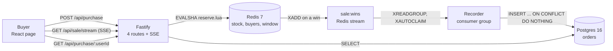

# Flash sale

One product, 1,000 units, a start time and an end time. Thousands of buyers arrive at once, and
each one may take one unit. No unit is ever sold twice.

TypeScript on Node 24. Fastify for the API, Redis 7 for the decision, Postgres 16 for the record,
React 19 for the page.

## Run it

You need Node 24 or newer and Docker.

```sh
cp .env.example .env     # the ports, the stock and the sale window
npm install
npm run db:up            # Redis and Postgres in Docker
npm run build            # type checks 3 workspaces, and builds the page
npm start                # the server on :3000, and the recorder beside it
```

Open `http://127.0.0.1:3000`. The page is served by the same server as the API, so there is one URL
and no CORS.

`.env.example` opens the sale in 2026 and closes it in 2036, so the sale is open the moment you
start. Change `SALE_START` and `SALE_END` to see the other states. Where Redis or Postgres already
runs on your box, change `REDIS_PORT` and `POSTGRES_PORT`, and change the two URLs beside them.

**Tests.** `npm test` runs all 47. Redis and Postgres are real, started by testcontainers, so Docker
must be running. Nothing is mocked.

**While you develop.** `npm run dev` runs the server, the recorder and Vite together. Vite serves
the page on `http://127.0.0.1:5173` and sends `/api` to the server.

**Stop.** `npm run db:down` removes both containers and their data.

## Run the stress test

```sh
npm start                # in one terminal
npm run stress           # in another
```

It empties the sale and the orders table, then drives **10,000 buyers over 500 connections** and
reads all 3 stores. It refuses to run against any host but localhost, because it truncates a table.

Expected outcome, and the run fails loudly on any other:

```
ok  won                 1000  (want 1000)
ok  sold-out            9000  (want 9000)
ok  other                  0  (want 0)
ok  redis stock left       0  (want 0)
ok  redis buyers        1000  (want 1000)
ok  pg orders           1000  (want 1000)
PASS
```

`npm run bench` is the other half. It measures throughput with autocannon and it never checks a
count, because autocannon reads its `amount` as a per-connection quota.

## How it works



**Redis decides, and Postgres remembers.** The decision is one Lua script, so Redis runs the whole
read and write with nothing in between. The record is written after the fact by a separate process,
so a slow disk never slows a buyer down.

**The 4 routes.**

| Route | Answers |
| --- | --- |
| `GET /api/sale` | `pending`, `open`, `sold-out` or `closed`, and the units left |
| `GET /api/sale/stream` | the same, pushed over SSE whenever it changes |
| `POST /api/purchase` | one of `won`, `already-bought`, `sold-out`, `not-open`, `over` |
| `GET /api/purchase/:userId` | whether that buyer holds a unit, and when they got it |

One ticker serves every open page. It reads the state once per tick and writes to each open socket,
so 1,000 pages cost 1 read and not 1,000.

## Why no unit is oversold

Everything that decides an outcome happens inside `server/src/gate/reserve.lua`. Redis runs one
script at a time, so no second buyer reads the counter between the first buyer's read and write.

The script does 4 things in order, and it stops at the first one that fails.

1. Reads `sale:window`, and refuses with `not-open` or `over` where the clock is outside it. The
   clock is passed in as an argument, so a test needs no fake clock.
2. Adds the buyer to the `sale:buyers` set. An add that changes nothing means the buyer already
   holds a unit, so the answer is `already-bought`.
3. Reads `sale:stock`. At 0 the buyer is removed from the set again, and the answer is `sold-out`.
4. Decrements the counter and appends the win to the `sale:wins` stream.

**The unique index is the second guard.** `orders.user_id` is unique, so a defect in the script
above still cannot write a second row for one buyer. The recorder inserts with
`ON CONFLICT (user_id) DO NOTHING`, so a replayed batch writes nothing and raises nothing.

**The row is written before the entry is acknowledged.** A recorder that dies between the two
replays the batch, and the replay writes nothing new. A lost win is the failure that matters. A
repeated win is not.

## Measured

On this box: Intel Core Ultra 9 275HX, 24 cores, 62 GB RAM, Node 24.11.1, Redis 7 and Postgres 16
in Docker. Every number below names the command that produced it.

| Measure | Number | Command |
| --- | --- | --- |
| Buyers, and the units they took | 10,000 buyers, exactly 1,000 won | `npm run stress` |
| Time for all 10,000 | 1.10 s, so 9,068 purchase requests a second | `npm run stress` |
| `GET /api/sale` throughput | 26,461 a second, p50 18 ms, p99 26 ms | `npm run bench` |
| `POST /api/purchase` throughput | 28,853 a second, p50 16 ms, p99 26 ms | `npm run bench` |
| Errors and non-2xx under load | 0 and 0 | `npm run bench` |
| Tests | 47, over real Redis and real Postgres | `npm test` |

**What the stress number means.** 9,068 a second is the rate at which this one Node process decided
10,000 outcomes correctly. It is lower than the bench figure because the stress run creates 10,000
distinct buyers, so every one of them writes to the Redis set and 1,000 of them append to the
stream. The bench run repeats one buyer, so it measures the cheapest path.

**What it does not mean.** The load generator and the server share 24 cores, so both numbers are a
floor and not a ceiling. Nothing here is tuned. There is one Node process and no cluster.

## Trade-offs

**Redis holds the truth during the sale, and Postgres holds it after.** A single Postgres row lock
would also prevent an oversell, and it would cost a disk write on the buyer's own request. Redis
answers from memory, and the durable write moves off the request path.

**Postgres, and not SQLite.** For 1,000 rows written by 1 consumer, SQLite is enough and it needs no
container. Postgres is here because it is the store a real sale uses, so the design does not change
when the sale grows. That is the trade: one more container in exchange for a design that survives
the next requirement.

**Nothing is mocked.** The brief allows a mocked cloud service. Instead the queue is a real Redis
stream with a consumer group, the cache is a real Redis key, and the database is real Postgres. All
3 are the managed services a deployment buys, so the code does not change when they move.

**Server-sent events, and not polling.** The page needs one direction only, so a WebSocket buys
nothing. SSE reconnects by itself, and it is plain HTTP.

**A crash loses no win.** The win is in the Redis stream before the buyer reads the answer. A
recorder that dies is replaced, and `XAUTOCLAIM` hands the dead reader's entries to the next one. A
lost consumer group rebuilds itself at id 0, which is what Redis needs after a restart with no saved
data.

**What is deliberately absent.** No authentication, because the brief names a username or an email
as the whole identity. No payment. No deployment. No rate limit, which a real sale needs and this
one does not claim.

## Scaling

The design holds at 10 times the load, and each step below is a change in count and not in shape.

**More API processes.** Fastify holds no state, so `N` processes behind one load balancer answer
`N` times the requests. The decision stays correct, because the decision is in Redis and not in the
process.

**One Redis, and the script is the limit.** A single Redis node runs about 100,000 of these scripts
a second, so one node carries 100,000 buyers a second. The sale is one product, so the counter
cannot be sharded by key. Where one product must exceed one node, the stock is split into `N`
counters of `stock / N` and the buyer is hashed to one of them, which trades a perfect sell-out for
throughput.

**More recorders.** The consumer group already allows it. Each new recorder takes a share of the
stream, and `XAUTOCLAIM` covers the one that dies. Postgres sees batched inserts and never the
request rate.

**The page.** It is static files. A CDN serves them, and the SSE stream stays on the API.

**What breaks first.** The single Redis node. Before that, the 10,000 open SSE sockets on one Node
process, which is a memory limit and not a CPU one.

## Layout

```
server/   Fastify, the Lua gate, the recorder, 40 tests
web/      React 19 on Vite, 7 tests
stress/   the correctness run, and the throughput bench
docs/     the development plan, the test plan, the decisions
concepts/ the design, authored before the code
```

`docs/development-plan.md` and `docs/test-plan.md` are the two documents the work was done against.
Every test row names the test that proves it. `docs/decisions.md` holds one question and one answer
for each decision above.
