# Architecture

Why the system has this shape, and what each choice costs.

## Redis decides the winner, and Postgres keeps the record

The sale asks two things of a store, and the two pull in opposite directions.

- The decision must be fast and atomic. Nothing runs between the read and the write.
- The record must survive a crash. The row must reach disk before the store acknowledges the write.

One store fits neither job well. So the design splits them. Redis decides the winner, and Postgres only records the result.

`Pipeline.reserve` in `server/src/queue/pipeline.ts` holds the decision. It runs one Redis script, `RESERVE` in `server/src/queue/scripts.ts`, then sends the win to Kafka. `Gate.record` in `server/src/gate/gate.ts` reads that topic and writes the order row.

A buyer who wins hears so at once. The order row reaches Postgres a few milliseconds later. Over 1,000 wins that gap ran from 566 ms to 3,285 ms. `GET /api/purchase/:userId` reads Postgres. It lags by that same gap.

**What the split buys.** Each of the three stores fails on its own. I injected 2 seconds of delay into the Postgres link. The sale kept answering buyers at 1,740 decisions a second, with all 1,000 wins intact. Compare a design that writes the order inside the request. The same fault committed 0 wins there, and the buyer never heard an answer.

**What the split costs.**

1. Two more containers are two more ways to fail. Where Redis is unreachable, the sale refuses every buyer.
2. Two stores disagree for a short window, named above.
3. Inside that window, one Redis setting carries the durability. Redis appends every change to a file and flushes it once a second under `appendfsync everysec`, so a power cut can cost up to a second of acknowledged wins. A `kill -9` is different. It ends the process, the file survives, and the container lost 0 of 15,619 acknowledged writes.
4. A gap between two stores needs a repair path. The worker writes its resume point in the same transaction as the order row.

A faster design exists. Let one process own the count, send every buyer through it, and let nothing else write. That is a single writer, and it runs 2.5 times faster. A second process breaks it. Making it safe needs a fence. A fence is a guard that stops the old owner from writing once a new one takes over. It costs a third of that speed. The single writer still lost 477 acknowledged wins when I killed the process. Speed that loses an acknowledged win is not a trade this sale can take.

## The record store is Postgres and not SQLite

The sale writes 1,000 rows through 1 writer, and SQLite handles that with no container.

I use Postgres anyway. A real sale runs on Postgres, and the design must hold when the sale grows. SQLite forces a redesign at the first second writer.

The cost is Docker. `docker compose up -d` starts both containers, and `npm test` starts its own through testcontainers.

## One Redis script replaces a lock

A sequence of steps that must not interleave usually calls for a lock. This design uses none. Redis runs one script as one command, and a script that runs alone needs no lock.

A lock fails in two opposite ways. The holder can die with the lock still held, which is why a lock needs a timeout. A timeout that is too short then releases the lock while the work still runs. A script has neither failure. Redis holds the server for the length of the script.

Each command inside the script is safe on its own.

| The decision | The command | Why it is safe alone |
| --- | --- | --- |
| Who gets unit number *n* | `INCR sale:sold` | It returns a different number to every caller. A buyer wins only where that number is at most the stock |
| Whether a buyer already holds a unit | `SADD sale:buyers` | It returns 1 to one caller and 0 to every other |

The script opens with a `GET` as a fast path, and that read never makes the decision. A stale read refuses a buyer the sale can still serve. The wrong `GET` costs one refused buyer, never a wrong count.

**The faults were in the gaps, not in the commands.** I shipped 4 plain commands first, and two faults lived between them.

1. **A buyer was told `already-bought` for a unit nobody won.** A buyer who loses at `INCR` leaves the set again through `SREM`. A second request from that buyer, arriving between the `SADD` and the `SREM`, read a set member and answered `already-bought`.
2. **A crash between `INCR` and the Kafka send burned a unit.** The counter moved, no record left, and the sale sold 999 of 1,000.

The script closes the first fault, because no other client runs inside it. It closes the second with `sale:outbox`. The script writes the buyer and the place into that hash in the same command that issues them. `Pipeline.deliver` runs `HDEL` only after the Kafka send returns. A row left in the hash is a win that Kafka never saw. `Pipeline.sweepOutbox` reads the hash every 250 ms and sends each row again. A second send is safe three times over: the producer is idempotent, the Kafka key is the buyer, and `orders` holds `UNIQUE (user_id)`.

The same command writes a second hash, `sale:issued`. The outbox empties when Kafka takes the win. The worker empties `sale:issued` later, after Postgres commits the order row. So `sale:issued` outlives the outbox, and a rebuild reads it. The two hashes answer different questions. The outbox says what to send again, and `sale:issued` says what place Postgres does not hold yet.

**Why no transaction.** A `MULTI`/`EXEC` block queues every command and answers them all at the end. `reserve` cannot read what `SADD` returned before it decides whether to call `INCR`. A block has no rollback either: where one command fails inside `EXEC`, Redis still applies the others. `WATCH` with a retry loop closes the first fault, and it swaps a lock-free path for one that retries under load.

The script costs one load, plus the `EVALSHA` recovery after a Redis restart. `Pipeline.runScript` catches `NOSCRIPT` and loads the script again. The gain is round trips: 4 commands take 4, and the script takes 1.

## No key expires, and the stock is what bounds them

Redis holds 5 keys, and the sale writes no others.

| Key | What it holds |
| --- | --- |
| `sale:sold` | the highest place the sale has issued |
| `sale:buyers` | one member for each winner |
| `sale:outbox` | a win that the Kafka send has not confirmed |
| `sale:issued` | a win that the order table does not hold yet |
| `sale:live` | the proof that Redis still holds this sale |

None of the 5 carries a time to live, which Redis calls a TTL. The `TTL` command answers `-1` on
each one, and `-1` means the key exists and never expires. A test asserts both facts, so a later
`EXPIRE` fails the suite.

An expiry is a fault and never a saving. `sale:issued` is the only record of a win that Kafka
carries and Postgres has not committed. A clock that deletes that entry deletes the win.
`sale:live` and `sale:sold` are worse. `RESERVE` reads them as the proof that the sale is whole, so
an expiry on either one refuses every buyer until the next rebuild.

Time does not bound the memory, and the stock does. `RESERVE` runs `SADD sale:buyers` only after
the sold-out check, and a buyer who loses at `INCR` leaves the set again through `SREM`. So the set
takes a winner alone, and it stops at the stock. README records the measured run. The two hashes
empty as each win lands, so they hold what is in flight and nothing more.

The keys do not outlive the sale either. The 250 ms sweep runs a third script, `RETIRE`, once the
window closes. It drops all 5 keys in one command, and it refuses while `sale:outbox` or
`sale:issued` holds a row. A row in either hash is a win that Postgres does not hold yet. So a slow worker
delays the drop by one sweep, and it never costs a place. Redis then holds nothing.

The same sweep stops rebuilding a closed sale, and that stop is what makes the drop stick. Without
it the sweep reads `sale:sold`, finds no counter, decides Redis is behind Postgres, and writes all
5 keys back. It repeats that 4 times a second for as long as the process runs. A counter in
`Pipeline.counts.rebuilds` makes the repeat visible, and a test reads it.

`Pipeline.left` then finds no counter and reads `stock.units_left` instead. Postgres was the
permanent record the whole time, so the number `GET /api/sale` answers after the sale is the final
one.

The same guard runs at the other end of the window. `Pipeline.phase` reads the clock and answers
`before`, `live` or `after`, and only the `live` phase builds anything. `armIfDue` then writes the
5 keys `ARM_MS` before the start time, which is 5 seconds. A pending sale therefore holds no key
at all, and the first buyer of the crowd finds the counter already there.

The count gets no vote in that decision. A sold-out sale is still live, and it keeps its keys until
the clock closes the window. A count that closes the sale breaks on the next erase. The
rebuild finds 0 sold, and it reopens a sale that already ended.

The proof is a load run and not a unit test alone. `npm run stress` sends 10,000 buyers at 1,000
units, moves the end time into the past, then reads Redis until it empties. Over 12 runs the peak
was 48,416 bytes over 5 keys every time. The drop landed 53 ms to 359 ms after the close, and
Postgres held all 1,000 rows.

The spread is the wait for the next sweep. I measured that wait on its own 30 times, from a random
point inside the 250 ms period. It read 26 ms to 255 ms, and the mean was 143 ms. So the delay is
flat across one period, and it is not a fixed cost.

**The trap is in Postgres, and not in Redis.** The order rows outlive the campaign that wrote them.
A second campaign against the same database starts sold out. The first rebuild reads the old
winners out of `orders`, and it puts the counter back where the last sale ended.
`UNIQUE (user_id)` refuses a returning winner as well. `npm run sale:window` moves the window and the unit count, and
it touches neither of those. `npm run reset` drops Postgres, Redis and the Kafka topic together,
and it is the only clean start. The Kafka topic matters as much as the rows. A worker subscribes
with `fromBeginning`, so an old topic replays the first campaign's wins into the second one.

## The unique index on the buyer is a second guard

The Redis set is the fast guard in memory. `UNIQUE (user_id)` on `orders` is the slow guard on disk. The two fail independently, and that independence is the reason both stay. Erase Redis, or replay a record, and the write still meets the index.

The insert uses `ON CONFLICT DO NOTHING`. A replay is then silent, and it needs no error handling. I measured that form at 73% cheaper than catching the `23505` error.

**The clause names no constraint on purpose.** `orders` also holds `UNIQUE (seq)`, and `seq` is the place Redis issued. Named `(user_id)`, a repeat place raised `23505`, `eachMessage` threw, and kafkajs crashed the consumer and met the same record again. One record then stopped a partition for good. A bare `ON CONFLICT` covers every unique index on the table. Postgres drops the repeat, and the worker moves on.

## What the queue worker guarantees

Exactly-once has three levels, and the code reaches two of them.

- **Delivery.** Two systems cannot agree on one commit. No code reaches it.
- **Processing.** The worker keeps a resume point, which is the place it starts reading from again. It writes that resume point inside the same transaction as the effect. The code reaches this level.
- **Effect.** The sink refuses a repeat on its own. The code reaches this level too.

Kafka transactions cover what Kafka writes. A Postgres row sits outside them. Redpanda states the same limit for its own broker: exactly-once holds "only when the consumer's output is sent to a Kafka topic itself and not to other remote syncs". KIP-939 was designed to let a Kafka producer join an external transaction. Its public APIs were reverted from Kafka 4.1, 4.2, 4.3 and 4.4. A broker swap does not move the boundary.

**That boundary is why `queue_offsets` exists.** The table holds the resume point, and `Gate.record` writes it in the same transaction as the order row. A record whose offset sits below the resume point is already applied. `Gate.record` returns `replayed` before it reaches the insert. Delete the table and the design drops to at-least-once delivery, where one record can arrive more than once. The exactly-once effect then rests on `UNIQUE (user_id)` alone.

The consumer runs with `autoCommit: false`. A per-worker timer commits to Kafka only offsets that Postgres already wrote. The Kafka resume point can never run ahead of the record. There is no `seek`. Kafka says where to resume, and a wrong answer there costs time. Postgres says what was applied, and only Postgres is a correctness claim.

A crash between the two commits replays the record, and the guard refuses it. A total loss of `__consumer_offsets` replays the partition from offset 0, and the guard refuses every record already applied.

The manual commit also keeps the standard lag metric honest. `kafka-consumer-groups --describe --group sale-writers` reads the offset the worker wrote after its Postgres `COMMIT`, so the lag it prints is work Postgres has not taken yet.

**Order survives 4 workers.** Each worker carries the number `INCR` issued, all the way into `orders.seq`. The 4 workers write in whatever order they finish, and rows arrive out of order. By arrival time I counted 19, 487 and 460 pairs in the wrong order across three runs. `ORDER BY seq` showed 0 such pairs in every run.

## Losing a store, and getting it back

Redis holds the count, and the count is the sale. So the design has to answer what happens when Redis loses it.

Two detectors find the loss, and both end in one rebuild from the order rows.

1. **The two keys the script checks first.** `RESERVE` refuses before it counts where either `sale:live` or `sale:sold` is gone, and it answers `lost`. `Pipeline.reserve` then rebuilds and asks once more. `REHYDRATE` writes the counter even at 0. A counter that exists is the proof that Redis still holds the sale. It writes the flag last. A script that dies half way then leaves the sale refused rather than wrong.

   An earlier build guarded on `sale:live` alone. Delete only `sale:sold`. A Redis that runs out of memory can drop a key on its own. That needs an eviction policy, which the operator sets. The deletion then looks the same. This compose file sets no memory ceiling, so the shipped Redis evicts nothing and refuses the write instead. A production Redis usually sets a ceiling, and the guard is there for that one. The flag still passed the guard. `INCR` then restarted at 1 and handed a buyer a place Postgres already held. `orders` holds `UNIQUE (seq)`, so Postgres rejected the row. The buyer still read `won` for a unit they do not hold.
2. **The counter check in the sweep.** A deletion cannot get past the check above. A counter rewritten to a lower number can, and the sweep is what catches that. Redis issues the place, and Postgres records it later. While Redis is whole, `sale:sold` is never below `MAX(orders.seq)`. The sweep reads one indexed `MAX(seq)` every 250 ms.

The rebuild reads two sources, because Postgres alone does not hold every place. A win travels from the script to Kafka, and then to the order table. A place in flight sits in neither source that the rebuild can read. So `RESERVE` writes the buyer and the place into `sale:issued` in the same command that issues them. The worker deletes that entry later, after Postgres commits the order row. An entry left in the hash is a place Postgres does not hold yet.

`REHYDRATE` reads the order rows and `sale:issued` together, and it raises the counter to the highest place either source names. It never lowers `sale:sold`. So a rebuild can undersell and can never issue a place twice.

An earlier build read Postgres alone and ran `DEL` on `sale:outbox`. A counter erased mid-sale then threw away every win that Kafka had not recorded yet. One measured run told 1,000 buyers `won` and wrote 760 rows, and 240 units stayed unsold. With `sale:issued` the same fault reads 1,000 `won`, 1,000 rows and 0 units left over 3 runs, with the erase at place 284, 205 and 208.

## Scaling

Each bottleneck below carries the measurement that found it and the change that moves it.

### Database connections

A million buyers do not open a million connections, and no request waits on one.

Postgres starts one OS process per connection, each about 5 MB, with a default `max_connections` of 100. A browser socket is not a database connection. `server/src/server.ts` builds one `pg.Pool` with `max: DB_POOL_MAX`, and that number caps what the process opens.

| Open sockets | `DB_POOL_MAX` | Peak Postgres backends | Requests a second |
| --- | --- | --- | --- |
| 500 | 20 | 4 to 5 | 6,750 to 8,380 |

At 500 open sockets only 4 or 5 connections are ever in use. Redis answers the buyer path. That path never touches the pool. Only the queue workers and the page reads open a connection, and they arrive at the rate the queue drains. An earlier design opened a transaction per purchase and held all 20 at the peak.

A bounded pool turns a database failure into a wait inside the application, and that wait has a limit you can see. An arrival spike lands in Kafka instead, where the workers drain it at whatever rate the pool allows.

When one process is not enough, PgBouncer goes in front of Postgres in transaction mode. In that mode a client holds a server connection for one transaction only, and thousands of clients then share tens of server connections. Size `pool_size` from the core count, never from the client count. PostgreSQL 18 added asynchronous I/O, and it still ships no built-in pooler.

### The one stock row

Every queue worker takes its unit with an `UPDATE` on row `id = 1`. Those writes run one at a time. Redis already answered, and the buyer waits for none of it. At 1,000 units the serialized writes finish fast. At 1,000,000 units the drain is the wall.

The change is `N` stock rows of `stock / N`, with each buyer hashed to one row. It gives up a perfect sell-out: one of those rows can empty while another still holds units. It pays off only at a large unit count, where the imbalance stays small.

### Accepting the load before it reaches the API

One Node process cannot absorb a million requests in one second, whatever the database does. The changes, in the order they pay off:

1. **More API processes.** Fastify holds no state. `N` processes behind one load balancer answer `N` times the requests. One Redis still holds the count, and no process decides alone.
2. **A waiting room.** Admit a bounded number of buyers per second to the purchase route, and hand everyone else a queue position. The sale sells out at the same moment either way, and a fast refusal replaces a timeout.
3. **More queue workers and more partitions.** The write is already off the request path. `QUEUE_WORKERS` sets how many consumers the process runs, and each consumer owns whole partitions. A number above the partition count leaves consumers idle.

### The page, and the open sockets

One Node process that holds 10,000 open stream sockets reaches a memory limit. One ticker serves all of them, and CPU stays cheap. The static files belong on a content delivery network. The stream stays on the API.

### What breaks first, in order

1. The single Node process, when it runs out of open sockets.
2. Redis, on one CPU core. Its commands run on one thread, so the whole decision path sits on that core. The ceiling is still high.
3. The queue drain, once wins arrive faster than the workers retire them. A buyer never feels it. The lag on `GET /api/purchase/:userId` grows instead.
4. The single stock row, far above 1,000 units.

### The shape at a million buyers

The picture below draws every change above. I built none of it. Each box names the measurement that calls for it.

## What this design does not promise

The place number restores the arrival order for a reader, and the rows do not *land* in that order. A reader who sorts by insert order still sees the wrong list. Only a single writer fixes that, and the cost of a single writer is in the first section.

One Redis key is one point of failure for the sale it serves. A busy launch needs a key per sale. Both keys of one sale have to live on one node. A hash tag does that, because Redis picks the node from the part of the key name inside braces. Name them `{sale1}:sold` and `{sale1}:buyers`, and the counter stays correct after the change. Correctness here is a per-key property. The design implies the result. I never measured it.
