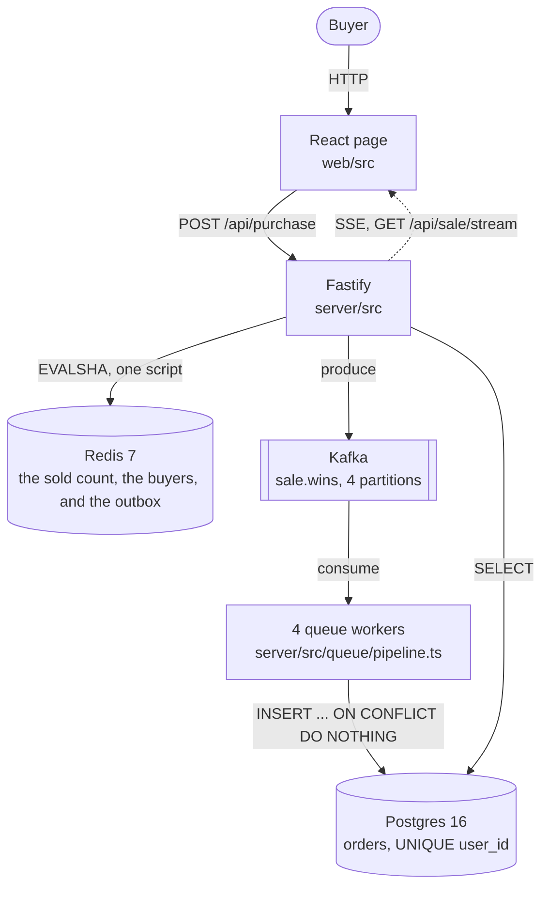

# Development plan

## How to read a row

Every development task has an identifier, `D-01` to `D-16`. The numbers only go up, and a dropped row keeps its number.

Status is one of planned, in-progress, done, blocked or dropped. I give a blocked row and a dropped row one line of reason each, and every other status gets none.

The last column names the test cases that cover the task. The cases run from `T-01` to `T-58` and come from the case table in [`docs/test-plan.md`](test-plan.md#cases).

## Context

One product has limited stock. Far more buyers arrive than there are units.

The system sells each unit once, and it refuses a second unit to the same buyer. It also refuses any purchase outside the sale window.

I end the project with one stress run: 10,000 buyers compete for 1,000 units. That one run has to prove all three rules at once, and it reports exactly 1,000 winners and exactly 9,000 refusals. The order table holds exactly 1,000 rows.

## Decisions

Each row says why I made the choice. `docs/architecture.md` holds the same reasons in the form the code shipped.

| Axis | Choice | Rejected | Evidence |
| --- | --- | --- | --- |
| Who decides the winner | One Redis script, `RESERVE` | A lock around a read and a write | Redis runs one command at a time, so each command already answers one caller. No step needs a lock. |
| Where the order is kept | Postgres 16 | SQLite | SQLite allows one writer, so the server cannot run as more than one process. |
| How the win reaches the database | A Kafka topic, drained by 4 workers | A write inside the request | The buyer is answered in about 1 ms, and an unread message survives a worker crash. |
| The second guard | `UNIQUE (user_id)` on the order table | Trusting the gate alone | Two independent guards fail apart. One bug then cannot reach the record. |
| Repository layout | npm workspaces, `server` and `web` | Two repositories | One `npm install` sets up the whole project for the reviewer. |
| What proves the counts | A script over undici, with 500 calls in flight | autocannon alone | autocannon `amount` is a per-connection quota. A measured run of `-a 1000000 -c 100` sent 999,969 requests and reported no error, so it cannot prove an exact count. |
| What reports the throughput | autocannon | No throughput number | The README needs requests per second and a p99 from a named tool, and the undici script is built for exactness and not for pacing. |
| How a test gets Redis and Postgres | testcontainers-node, started by the test run | `docker compose up -d` and a wait loop | `npm test` is then the whole command, so a reviewer who runs it first hits no red suite. |
| How the page follows the sale | Server-sent events | Polling on a timer | The sale state travels one way, server to page. No page asks for an update that did not happen. |

## Architecture



Two processes run: the Fastify server, which holds the workers, and the page. Redis, Kafka and Postgres run in Docker. I put the diagram in the README as a fenced `mermaid` block, and GitHub renders it. No build step, no image to commit.

## Components

| Module | Role | The invariant it owns |
| --- | --- | --- |
| `server/src/config.ts` | Reads the stock, the window and the ports from the environment | Every number the sale uses comes from outside the source. A missing one stops the process at boot. |
| `server/src/queue/pipeline.ts` | Decides one purchase, and drains the wins | The count never falls below zero, and one buyer identifier never takes two units. |
| `server/src/gate/gate.ts` | Writes the order and the offset in one transaction | A replayed message writes nothing twice, because the offset moves with the row. |
| `server/src/gate/status.ts` | Answers the sale state | The clock and the count decide the state. No code stores it as a separate fact. |
| `server/src/routes/stream.ts` | Pushes the sale state to every open page | A closed page releases its connection, so a reload never leaves one behind. |
| `server/src/db/migrate.ts` | Owns the schema | The database refuses a second row for one buyer. The code above it does not. |
| `server/src/routes/orders.ts` | Answers whether a buyer holds a unit | The answer reads the record, so it stays true after a gate reset. |
| `web/src/api.ts` | Talks to the server | Each of the five outcomes has a name. An unknown answer is an error, not a silent state. |
| `web/src/App.tsx` | Shows the sale and takes an attempt | The page never decides an outcome. It names the outcome the server gave. |
| `stress/run.ts` | Produces the two counts | The script sends exactly 10,000 requests, reads every body, and asserts the counts. |
| `stress/bench.ts` | Produces the throughput number | The number comes from a run, and the script prints the command that produced it. |

## Structure

```
flash-sale/
  package.json            npm workspaces: server, web, stress
  tsconfig.base.json      the compiler settings all three share
  docker-compose.yml      redis:7  postgres:16  kafka, for running the app
  diagrams/               the two architecture diagrams the README shows
  docs/                   this file, architecture.md, test-plan.md
  server/
    src/                  config.ts server.ts, then routes/ gate/ queue/ db/
    src/routes/           sale.ts orders.ts stream.ts, one file per endpoint group
    sql/migrations/       the order table, the campaign row and the ledger
    test/                 unit/ integration/ setup/
  web/
    src/                  main.tsx App.tsx api.ts styles.css
    test/                 unit/ integration/ setup/dom.ts
  stress/
    run.ts                10,000 buyers over undici, and the three assertions
    bench.ts              the autocannon run, for requests per second
```

All source lives under two prefixes: `server/src` and `web/src`.

## Endpoints

| Route | Input | Output | Error contract |
| --- | --- | --- | --- |
| `GET /api/sale` | none | `{state, stockLeft, startsAt, endsAt}`, and `state` is one of `pending`, `open`, `sold out`, `closed` | 500 with `{error}` when Redis does not answer. It never reports `sold out` for a Redis it could not reach. |
| `GET /api/sale/stream` | none | `text/event-stream`. One `sale` event on connect, then one per change | The stream ends on a Redis fault, and the page then shows a fault and never a state. A closed page releases the connection. |
| `POST /api/purchase` | `{userId}` | `{outcome}`, one of `won`, `already-bought`, `sold-out`, `not-open`, `over` | 400 with `{error}` for a missing or empty `userId`. 500 with `{error}` when Redis does not answer, and never an outcome. |
| `GET /api/purchase/:userId` | the buyer identifier in the path | `{held: true\|false, at}` | 400 for an empty identifier. 503 with `{error}` when Postgres does not answer, because "no row" and "cannot read" are different answers. |

A refusal and a fault have to look different on the page. The error column is where I draw that line.

## Integration

`docker compose up -d` starts Redis, Kafka and Postgres for the app, and `npm run dev` starts the server and the page. `npm test` does not need the compose stack. testcontainers starts its own set. `npm run stress` opens the sale and drives 10,000 buyers over 500 connections, then reads Postgres.

## Task table

Each row lists the files it owns in the repository as it ships. Where I replaced a file during the build, the row names the replacement, and the section "What changed after the plan" below says why.

| ID | Title | Status | Paths it owns | T-nn covering it |
| --- | --- | --- | --- | --- |
| D-01 | Set up the npm workspaces and the shared TypeScript settings | done | package.json, tsconfig.base.json, vitest.config.ts, .gitignore, .env.example, server/package.json, server/tsconfig.json, web/package.json, web/tsconfig.json, stress/package.json, stress/tsconfig.json, server/test/unit/strip.spec.ts | T-01, T-36 |
| D-02 | Bring up the stores, and start the same set from the test run | done | docker-compose.yml, server/sql/migrations/, server/test/setup/containers.ts | T-02, T-30 |
| D-03 | Read the addresses and the sizes from the environment | done | server/src/config.ts, server/test/unit/config.spec.ts | T-03 |
| D-04 | Decide one purchase in Redis | done | server/src/queue/pipeline.ts | T-04, T-05, T-06, T-07 |
| D-05 | Call the decision from the server | done | server/src/queue/pipeline.ts, server/src/server.ts | T-04, T-05, T-08, T-29 |
| D-06 | Answer the state of the sale | done | server/src/gate/status.ts | T-09, T-31 |
| D-07 | Serve the three routes, and the stream | done | server/src/server.ts, server/src/routes/sale.ts, server/src/routes/stream.ts | T-10, T-11, T-12, T-28, T-32, T-33 |
| D-08 | Drain the queue of wins into Postgres | done | server/src/queue/pipeline.ts, server/src/gate/gate.ts | T-13, T-14, T-21, T-34, T-35, T-37 |
| D-09 | Answer whether one buyer holds a unit | done | server/src/routes/orders.ts, server/test/setup/db.ts | T-15, T-24 |
| D-10 | Build the page the buyer uses | done | web/index.html, web/vite.config.ts, web/src/main.tsx, web/src/App.tsx, web/src/api.ts, web/src/styles.css, web/test/setup/dom.ts, web/test/unit/App.spec.tsx, server/src/server.ts | T-01, T-16, T-17, T-22, T-38, T-39, T-40, T-41 |
| D-11 | Drive 10,000 buyers, read the counts, and measure the throughput | done | stress/run.ts, stress/bench.ts | T-18 |
| D-12 | Write the README with the diagram, the reasons and the measured numbers | done | README.md | T-19, T-23, T-25 |
| D-13 | Ground every concept row on the symbol that realizes it | dropped | — | T-20, T-43, T-44, T-45 |
| D-14 | Write the scaling section of the README, and say what changes at 10 times the load | done | README.md, diagrams/architecture-scale.mmd | T-23 |
| D-15 | Make the repository safe to publish, and prove a fresh clone runs | done | .gitignore, .env.example | T-26 |
| D-16 | Write the architecture document, one reason for each choice | done | docs/architecture.md | T-27, T-42 |

## What changed after the plan was written

I wrote the plan before the code. Two parts changed during the build. The rows already name the files that ship.

| Planned | Ships | Why it changed |
| --- | --- | --- |
| One Lua script, `reserve.lua`, decides a purchase | One Lua script, `RESERVE` in `server/src/queue/scripts.ts` | The script is back, and it lives in a `.ts` file as a string. `server/tsconfig.json` includes `src/**/*.ts` only, and the build is a bare `tsc`. A `.lua` file would never reach `dist/`. I shipped 4 plain commands first and reverted that, because 2 faults lived in the gaps between them |
| A Redis stream, `sale:wins`, carries the win to a recorder process | A Kafka topic, `sale.wins`, over 4 partitions, read by workers inside the server | A stream consumer group is lost when Redis restarts with no saved data. Kafka keeps the topic on disk, and the offset lives in Postgres beside the order row |
| The stock and the window are environment variables | A row, written by `server/sql/migrations/0002_campaign.sql` | The window belongs with the data it bounds. `CHECK (end_at > start_at)` then refuses a bad window at the database |
| D-13 grounds every row of a concept map | dropped | The map was a planning tool. It shipped no behaviour, and its tests read the map rather than the code |
| Three document tests read the README and the decision log | dropped | A test that reads prose turned red on every edit, and it proved nothing about the sale |

Both of the first two rows changed after a measurement. `docs/architecture.md` holds the reason each one changed.

## What the build found

Six findings came out of the build. No unit test caught any of them, and each one now has a test behind it.

1. `node --experimental-strip-types` only deletes types, and `npm start` never worked. A constructor parameter property is a SyntaxError, and the server held 6 of them. Vitest compiles the TypeScript, and that is why the tests stayed green. No test caught the error. `server/test/unit/strip.spec.ts` now reads every file under `server/src` through `stripTypeScriptTypes`.
2. The scripts carried no `--env-file`, and `npm start` never read `.env`. The documented start command stopped at boot and named every missing variable.
3. Two test files shared one `orders` table. They run in parallel and wiped each other's rows. That was the race. Each file now migrates its own Postgres schema.
4. A timer commit cannot hold the resume point. `autoCommit` moves the offset on a clock, so a dead worker leaves an offset past a row Postgres never wrote. The resume point now lives in `queue_offsets`, written in the same transaction as the order row. `Gate.record` refuses any record below it. An earlier draft of this file claimed a measured loss of 201 of 1,000 rows. No harness for that run survives, and kafkajs 2.2.4 resolves an offset only after `eachMessage` returns, so I removed the number.
5. The drain check counted the wrong records. A replay and a duplicate buyer are the same record twice, and neither one counts. I counted both, and the check reported success at 49 of 50 rows.
6. Testing Library cleans up only under `globals: true`. Without `cleanup` in an `afterEach`, 4 of the 7 page tests read `Found multiple elements`.

The stress run empties the sale and truncates the orders table. I keep it on localhost for that reason. `assertLocal` rejects any hostname outside localhost, but `STRESS_ALLOW_HOST` overrides that check.

autocannon reports throughput, but I do not trust its request counts. Its `amount` is a per-connection quota: issue #228 measured 999,969 requests against a requested 1,000,000, and nothing errored. So `stress/run.ts` owns every count, and `stress/bench.ts` owns the latency.
